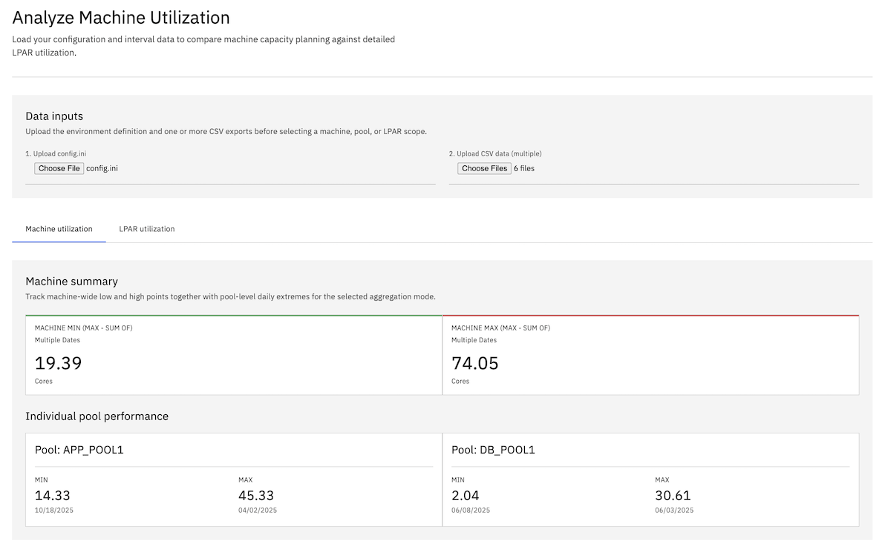
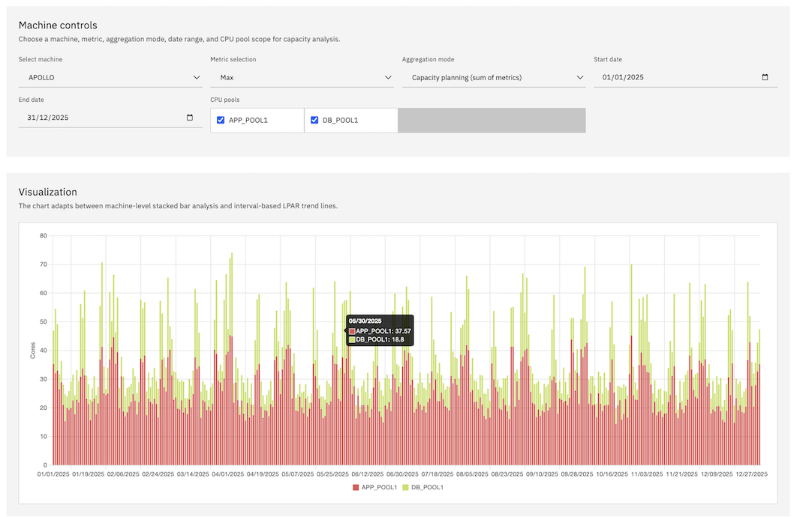
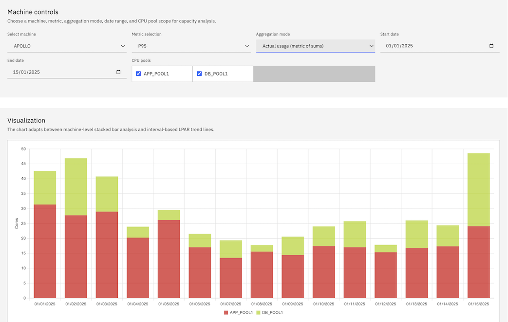
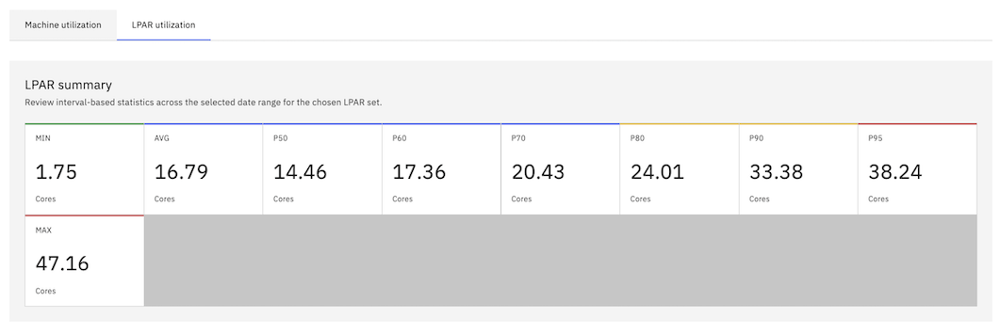
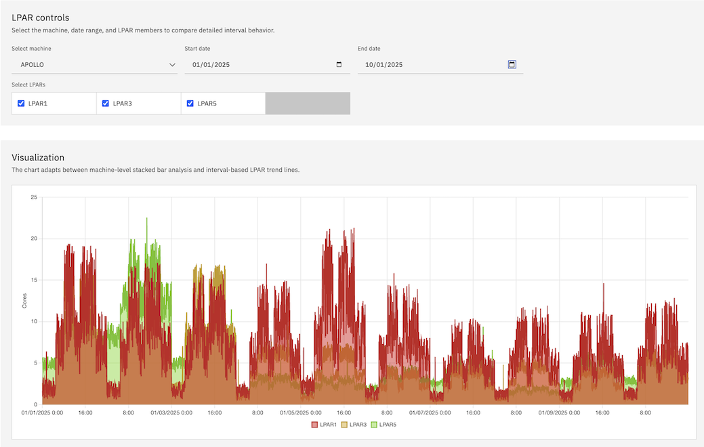
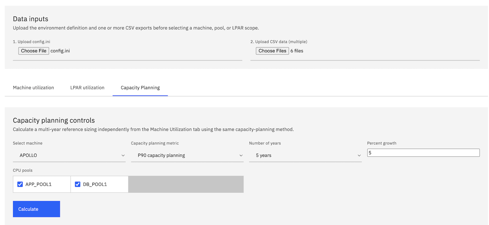
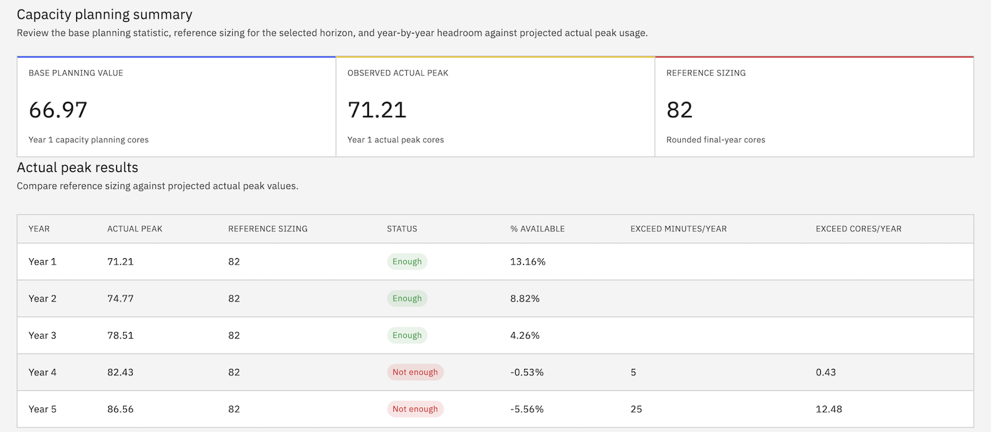
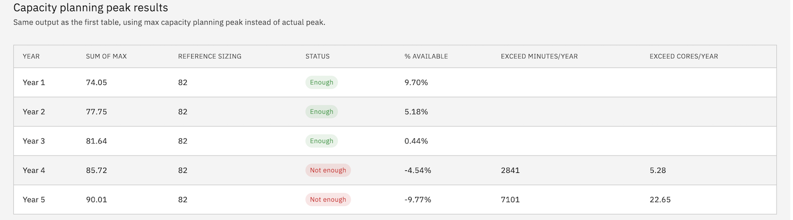
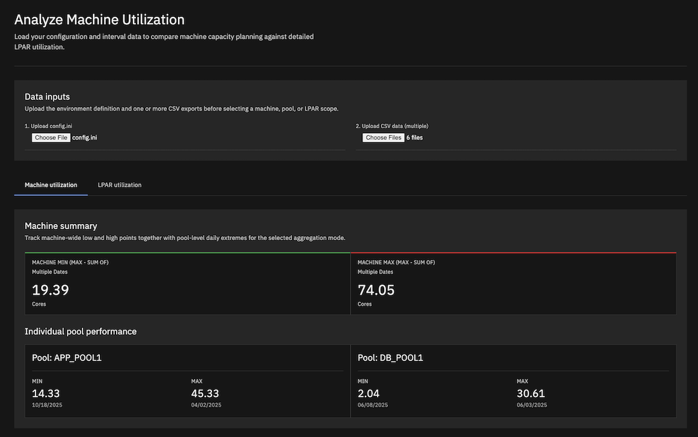

# CPU Utilization Visualizer
- [CPU Utilization Visualizer](#cpu-utilization-visualizer)
  - [Description](#description)
  - [Disclaimer](#disclaimer)
  - [Development](#development)
  - [Project Structure](#project-structure)
  - [Features](#features)
    - [Machine Utilization View](#machine-utilization-view)
    - [LPAR Utilization View](#lpar-utilization-view)
    - [Capacity Planning View](#capacity-planning-view)
  - [Aggregation Modes](#aggregation-modes)
    - [Actual Usage (Metric of Sums)](#actual-usage-metric-of-sums)
    - [Capacity Planning (Sum of Metrics)](#capacity-planning-sum-of-metrics)
    - [Capacity Planning (Sum of Metrics from Different Day)](#capacity-planning-sum-of-metrics-from-different-day)
    - [Key Differences](#key-differences)
    - [Example Scenario](#example-scenario)
    - [Configuration Example](#configuration-example)
    - [References](#references)
  - [UI Updates](#ui-updates)
  - [Screenshots](#screenshots)
    - [Machine CPU Utilization (Sum by Pool)](#machine-cpu-utilization-sum-by-pool)
      - [Overall](#overall)
      - [Graph](#graph)
      - [Select date range](#select-date-range)
    - [LPAR CPU Utilization (by Date)](#lpar-cpu-utilization-by-date)
      - [Overall](#overall-1)
      - [Graph](#graph-1)
    - [Capacity Planning with Percentile](#capacity-planning-with-percentile)
    - [Dark Mode](#dark-mode)
  - [How to Use](#how-to-use)
  - [Data Formats](#data-formats)
    - [`config.ini`](#configini)
    - [CSV Performance Data](#csv-performance-data)
    - [Supported Date Formats](#supported-date-formats)
  - [Example Data Generation (Python)](#example-data-generation-python)
  - [Architecture](#architecture)
  - [Technologies Used](#technologies-used)
  - [Percentile Calculation Methods](#percentile-calculation-methods)
    - [Overview](#overview)
    - [PERCENTILE.INC (Inclusive Method)](#percentileinc-inclusive-method)
    - [PERCENTILE.EXC (Exclusive Method)](#percentileexc-exclusive-method)
    - [Comparison Table](#comparison-table)
    - [Which Method to Choose?](#which-method-to-choose)
    - [Practical Example with CPU Data](#practical-example-with-cpu-data)


## Description

A single-page web application designed for the visualization of historical CPU utilization data. Initially conceived for IBM Power Systems (Logical Partitions), this tool can be readily adapted to accommodate other virtualization platforms as well.

The application facilitates the analysis of CPU usage patterns across multiple LPARs or Virtual Machines on physical hardware, organized by CPU Pools.

## Disclaimer

This application and repository are community-created utilities inspired by IBM design language for interface styling only. They are not official IBM software, products, services, or support offerings, and they are not affiliated with, endorsed by, or maintained by IBM.

## Development

The project is designed to be self-contained within `visualizer.html`, making it easy to deploy and use locally. All processing happens client-side in the browser with no server dependencies.

## Project Structure
 
```
cpu-utilization-visualizer/
├── visualizer.html           # Main application file
├── config.ini                # Machine and CPU Pool configuration
├── generate_cpu_data.py      # Create sample data for testing
├── data/                     # Sample of CSV files containing CPU utilization data
│   ├── lpar1.csv
│   ├── lpar2.csv
│   └── ...
├── DATA_GENERATOR_GUIDE.md   # Data Generator Guide
└── README.md                 # This file
```

## Features

-   **Browser-based SPA:** Runs entirely in your web browser, no server-side setup required.
-   **Data Ingestion:** Upload `config.ini` for machine and LPAR pool definitions, and multiple CSV files for LPAR performance data.
-   **Flexible Date Formats:** Supports multiple date formats in CSV files (MM/DD/YYYY, DD/MM/YYYY, YYYY-MM-DD, etc.), configurable via `config.ini`. See [Supported Date Formats](#supported-date-formats) for details.
-   **Date Range Filtering:** Select specific date ranges for analysis in both Machine and LPAR Utilization views using calendar widgets.
-   **Configurable Standby LPARs:** LPARs defined in `config.ini` but without corresponding CSV data are treated as standby, using a configurable default CPU core value (defaulting to 0.1).
-   **Percentile Calculation:** Supports both Inclusive (INC) and Exclusive (EXC) methods for percentile calculations, configurable via `config.ini`. See [Percentile Calculation Methods](#percentile-calculation-methods) for details.

### Machine Utilization View

-   **Stacked Bar Chart:** Visualizes daily CPU utilization for a selected machine, stacked by CPU pool.
-   **Date Range Selection:** Filter data by selecting start and end dates using calendar widgets. Default shows full date range (oldest to newest date).
-   **Metric Selection:** Choose between Max, Average, or various Percentiles (P50, P60, P70, P80, P90, P95) for daily aggregation.
-   **Aggregation Mode:** Select between Actual Usage, Capacity Planning (same day), and Capacity Planning (different day) calculation methods (see [Aggregation Modes](#aggregation-modes) below).
-   **Pool Toggling:** Dynamically show/hide individual CPU pools on the chart.
-   **Summary Dashboard:** Displays the minimum and maximum total daily CPU cores across the selected date range for the chosen machine and metric, along with per-pool min/max statistics.
-   **Capacity Exceed Statistics:** When using percentile metrics with Capacity Planning mode, calculate and display statistics for intervals where actual usage exceeds the maximum capacity planning threshold:
    -   **Total Minutes Exceeding:** Total time (in minutes) where actual usage exceeded the capacity threshold
    -   **Days with Exceed:** Number of days containing at least one exceeding interval
    -   **Total Cores Exceeded:** Cumulative sum of cores exceeded across all intervals
    -   **Max Cores Exceeded:** Peak single-interval exceedance (worst moment)

### LPAR Utilization View

-   **Stacked Line Chart:** Shows CPU utilization for selected LPARs with 5-minute interval granularity, stacked so the visible top boundary matches the combined total shown in the summary.
-   **Date Range Selection:** Analyze single or multiple days using start and end date pickers. Default shows oldest date (single day view).
-   **Sequential Multi-Day View:** When multiple dates are selected, displays continuous data from 00:00 of the first day to 23:55 of the last day.
-   **Interactive Tooltips:** Hover over data points to see detailed information including date, time, and CPU core values.
-   **Combined View:** Aggregates and displays the utilization of multiple selected LPARs.
-   **Summary Dashboard:** Provides detailed statistics calculated across all intervals in the selected date range, including Min, Max, Average, P50, P60, P70, P80, P90, and P95.

### Capacity Planning View

-   **Independent Planning Workflow:** Runs separately from the exceeded-capacity calculation in the Machine Utilization view while reusing the same combined-interval capacity-planning logic.
-   **Metric Selection:** Choose paired same-day and different-day planning metrics for Max, P95, P90, and P80 as the first-year planning baseline.
-   **Growth Inputs:** Provide a growth rate and a planning duration from 1 to 5 years, and the results render the same number of yearly rows as the selected duration.
-   **Reference Sizing Calculation:** Builds a fixed final-year reference sizing by compounding growth from the first-year capacity planning value, then rounds the result up to the next whole core.
-   **Dual Results Tables:** Shows two yearly output tables:
    -   *Max of Sum* compares projected **Actual peak** against **Reference sizing** and adds `Exceed Minutes/year` plus `Exceed Cores/year` only when status is `Not enough`
    -   *Sum of Max* compares projected **Sum of Max** against **Reference sizing** and also adds `Exceed Minutes/year` plus `Exceed Cores/year`
-   **Annualized Exceedance Projection:** `Exceed Minutes/year` and `Exceed Cores/year` are annualized to a 360-day year. Table 1 uses the combined-interval actual-usage method from Machine Utilization, while Table 2 uses the projected daily **Sum of Max** value for each sampled day before annualizing the exceedance.
-   **Availability Summary:** Shows base planning value, observed actual peak, reference sizing, yearly sizing sufficiency, and available percentage in Carbon-style result tables.

## Aggregation Modes

The Machine Utilization view offers three distinct calculation methods to serve different analysis purposes:

### Actual Usage (Metric of Sums)

**How it works:**
1. Combine all LPAR values at each 5-minute interval for the selected day
2. Calculate the selected metric from these combined intervals
3. Display the actual peak/percentile of the combined usage

**Example:**
- LPAR1 peaks at 20 cores (at 10:00 AM)
- LPAR2 peaks at 25 cores (at 3:00 PM)
- At 10:00 AM: LPAR1=20, LPAR2=15 → Combined=35
- At 3:00 PM: LPAR1=10, LPAR2=25 → Combined=35
- **Result: 35 cores** (actual maximum at a single moment)

**Use Cases:**
- ✅ **Utilization Analysis:** "What's the real simultaneous peak usage across all workloads?"
- ✅ **Waste Identification:** Compare actual usage vs. provisioned capacity
- ✅ **Performance Troubleshooting:** Identify true bottleneck moments
- ✅ **Consolidation Planning:** Understand actual combined resource consumption

**When to use:** Analyzing current utilization, identifying over-provisioning, or understanding real-world simultaneous resource consumption patterns.

### Capacity Planning (Sum of Metrics)

**How it works:**
1. Calculate the selected metric (Max, P95, P90, or P80) for each LPAR individually across all 288 intervals within the same day
2. Sum these metrics across all LPARs in each pool
3. Sum the pool values to produce a machine daily value
4. Take the highest machine daily value across the selected date range

**Important timing note:** The result comes from a single day, but each LPAR maximum can come from different intervals within that day.

**Example:**
- LPAR1 peaks at 20 cores (at 10:00 AM)
- LPAR2 peaks at 25 cores (at 3:00 PM)
- **Result: 45 cores** on that day

**Use Cases:**
- ✅ **Hardware Sizing:** "What capacity do I need if each workload hits its typical high usage on the same day?"
- ✅ **Budget Planning:** Conservative estimates for infrastructure investment
- ✅ **Capacity Planning:** Accounts for each workload's independent peak patterns within the same day
- ✅ **Risk Mitigation:** Ensures headroom for busy days even if peaks do not occur at the same time

**When to use:** Planning new hardware purchases when workloads are expected to be busy on the same day.

### Capacity Planning (Sum of Metrics from Different Day)

**How it works:**
1. Calculate the selected metric (Max, P95, P90, or P80) for each LPAR individually for each day
2. Sum those values within each pool for each day
3. Find the best day independently for each pool
4. Sum each pool's independent best-day value into a machine total

**Important timing note:** The result can combine different days across pools, and different intervals within those days.

**Example:**
- IST1 best day = 40.66
- WASND1 best day = 1.30
- DEFAULT1 best day = 4.00
- **Result: 45.96** even if those peaks do not occur on the same day

**Use Cases:**
- ✅ **Aggressive Sizing Envelope:** "What if each pool gets to contribute its own best day?"
- ✅ **Worst-Case Consolidation Estimate:** Size for independently peaked pools
- ✅ **Scenario Comparison:** Compare same-day planning vs. different-day planning assumptions

**When to use:** Evaluating a more conservative sizing envelope where each pool can contribute its own best day independently.

### Key Differences

| Aspect | Actual Usage | Capacity Planning (same day) | Capacity Planning (different day) |
|--------|--------------|------------------------------|-----------------------------------|
| **Calculation** | Metric of combined sums | Sum of individual metrics on the same day | Sum of each pool's best day |
| **Peak Timing** | Single interval | Single day, multiple intervals | Different days and different intervals |
| **Value** | Usually lowest | Usually higher | Usually highest |
| **Purpose** | Analysis & optimization | Planning & sizing | Conservative envelope planning |
| **Risk** | Realistic (actual) | Conservative | Most conservative |

### Example Scenario

**Scenario:** You have 3 LPARs on a machine:
- **Payroll LPAR:** Peaks every Friday at 5 PM (P95 = 8 cores)
- **Web Server LPAR:** Peaks Monday mornings (P95 = 6 cores)
- **Database LPAR:** Peaks during month-end (P95 = 10 cores)

**Actual Usage Mode (P95):**
- Result: **18 cores** (95% of the time, combined usage is below this)
- Interpretation: "These workloads rarely peak together, so 18 cores handles 95% of situations"
- Best for: Understanding current utilization and identifying over-provisioning

**Capacity Planning Mode (P95 - same day):**
- Result: 8 + 6 + 10 = **24 cores**
- Interpretation: "I need 24 cores to handle each workload's typical high usage on a busy day"
- Best for: Sizing a new machine to ensure all workloads have adequate resources on the same day

**Capacity Planning Mode (P95 - different day):**
- Result: can be **24 cores or higher** if each pool contributes its own best day independently
- Interpretation: "I want a sizing envelope based on independent pool best days"
- Best for: Comparing a more conservative planning scenario against the same-day assumption

**Important Note:** The values in Machine Utilization [`Actual Usage`](README.md:124) mode will match the stacked LPAR Utilization view when all LPARs are selected for the same date, as both calculate the metric from combined intervals.
- Interpretation: "I want a sizing envelope based on independent pool best days"
- Best for: Comparing a more conservative planning scenario against the same-day assumption

**Important Note:** The values in Machine Utilization [`Actual Usage`](README.md:143) mode will match the stacked LPAR Utilization view when all LPARs are selected for the same date, as both calculate the metric from combined intervals.

### Configuration Example

```ini
[MAIN]
PERCENTILE=INC  ; Use inclusive method (recommended, matches Excel/Google Sheets default)
# PERCENTILE=EXC  ; Use exclusive method (for statistical rigor)
STANDBY=0.1
INTERVAL=5
```

### References

- **Microsoft Excel Documentation:** [PERCENTILE.INC](https://support.microsoft.com/en-us/office/percentile-inc-function-680f9539-45eb-410b-9a5e-c1355e5fe2ed) and [PERCENTILE.EXC](https://support.microsoft.com/en-us/office/percentile-exc-function-bbaa7204-e9e1-4010-85bf-c31dc5dce4ba)
- **Google Sheets Documentation:** [PERCENTILE function](https://support.google.com/docs/answer/3094114)
- **Statistical Theory:** Hyndman, R.J. and Fan, Y. (1996). "Sample Quantiles in Statistical Packages", *The American Statistician*, 50(4), 361-365

## UI Updates

Recent interface updates in [visualizer.html](visualizer.html) include:

- IBM Carbon-inspired light theme structure for layout, spacing, cards, inputs, tabs, summaries, and tabular outputs
- Optional dark theme based on the Gray 100 theme guidance in [design.md](design.md) and [design-dark.md](design-dark.md)
- Segmented light/dark switch in the masthead
- Refined summary cards, comparison tables, and chart container styling for improved readability
- Added a Capacity Planning tab for multi-year reference sizing and projected peak sufficiency analysis, now with three result tables covering actual peak, same-day sum-of-max, and different-day sum-of-max
- Added a third Machine Utilization aggregation mode for `Capacity Planning (sum of metrics from different day)` and hides the machine chart for that mode
- Updated Machine Utilization summary labels to distinguish `Single day, multiple intervals` from simultaneous peaks
- Updated LPAR visualization to stacked rendering so the visible chart top matches the combined summary total
- Preserved original machine stacked-bar and LPAR line-chart color behavior for data clarity

## Screenshots

### Machine CPU Utilization (Sum by Pool)
#### Overall


#### Graph



#### Select date range



### LPAR CPU Utilization (by Date)

#### Overall



#### Graph



### Capacity Planning with Percentile
- Input



- Result
  - Reference sizing vs Actual peak
    
    

  - Reference sizing vs sum of peak
    
    

### Dark Mode



## How to Use

1. Open `visualizer.html` in a modern web browser.
2. Upload your `config.ini` file using the file picker.
3. Upload one or more CSV performance files.
4. Use the tabs to switch between Machine Utilization, LPAR Utilization, and Capacity Planning views.
5. Adjust metrics, date ranges, pools, growth rate, and planning years to explore results.

## Data Formats

### `config.ini`

The INI file configures global behavior and machine/pool-to-LPAR mappings.

Example:

```ini
[MAIN]
PERCENTILE=INC
STANDBY=0.1
INTERVAL=5
DATE_FORMAT=MM/DD/YYYY

[MACHINE1]
POOL_A=lpar1,lpar2
POOL_B=lpar3
```

### CSV Performance Data

Expected CSV columns:
- `date`
- `time`
- `lpar`
- `cpu`

Each CSV should contain 5-minute interval CPU data for a single LPAR.

### Supported Date Formats

Supported formats are controlled by `DATE_FORMAT` in `config.ini`, including:
- `MM/DD/YYYY`
- `DD/MM/YYYY`
- `YYYY-MM-DD`

## Example Data Generation (Python)

Use [`generate_cpu_data.py`](generate_cpu_data.py) to create sample datasets for testing.

## Architecture

- Single-file SPA in [`visualizer.html`](visualizer.html)
- Client-side parsing for INI and CSV inputs
- Chart rendering powered by Chart.js
- Capacity planning and percentile calculations performed in-browser

## Technologies Used

- HTML
- CSS
- JavaScript
- [Chart.js](https://www.chartjs.org/)

## Percentile Calculation Methods

### Overview

The app supports two percentile methods:
- `INC` for inclusive percentile calculation
- `EXC` for exclusive percentile calculation

### PERCENTILE.INC (Inclusive Method)

Matches Excel/Google Sheets inclusive percentile behavior.

### PERCENTILE.EXC (Exclusive Method)

Provides the exclusive percentile calculation variant often used in statistics.

### Comparison Table

| Method | Compatible With | Behavior |
|--------|------------------|----------|
| `INC` | Excel / Google Sheets default | Includes endpoints |
| `EXC` | Statistical workflows | Excludes endpoints |

### Which Method to Choose?

- Use `INC` when you want spreadsheet-compatible results.
- Use `EXC` when you need stricter statistical behavior.

### Practical Example with CPU Data

If combined interval values are `[10, 12, 14, 18, 20]`:
- `P50` gives the median
- `P90` gives a near-peak planning threshold
- Choice of `INC` vs `EXC` slightly changes the percentile output