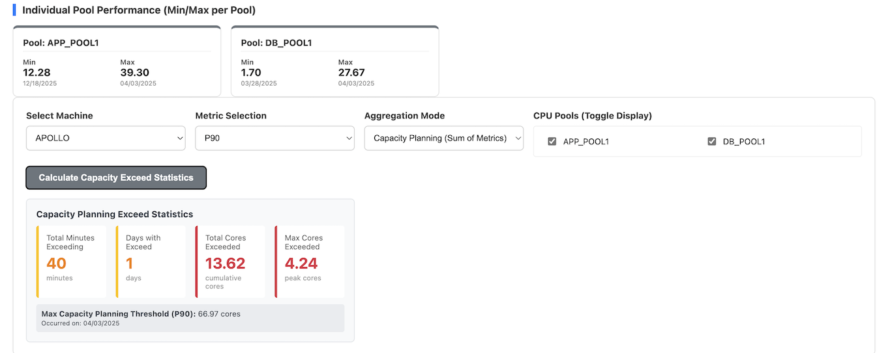
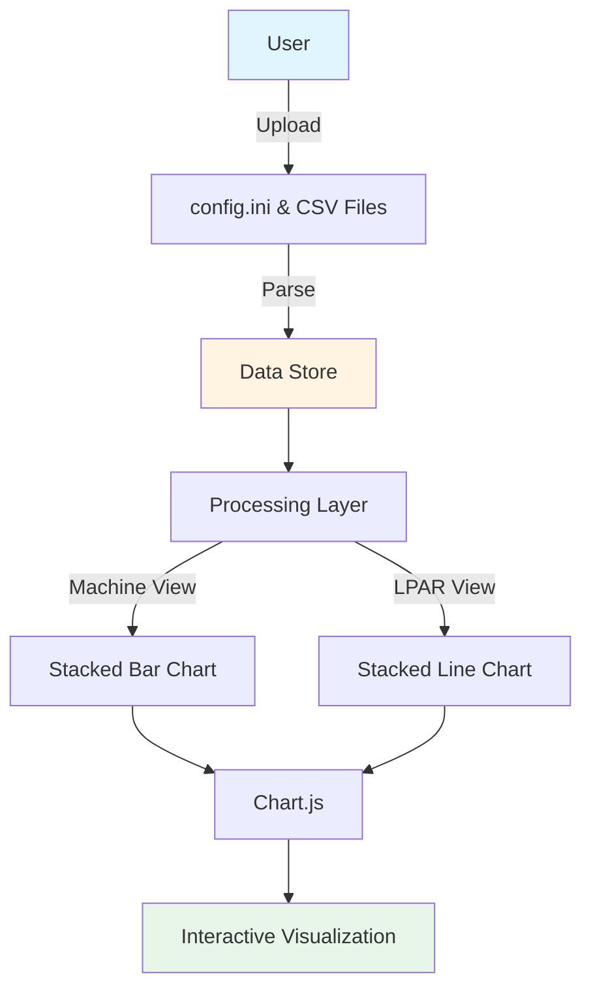

# CPU Utilization Visualizer
- [CPU Utilization Visualizer](#cpu-utilization-visualizer)
  - [Description](#description)
  - [Project Structure](#project-structure)
  - [Features](#features)
    - [Machine Utilization View](#machine-utilization-view)
    - [LPAR Utilization View](#lpar-utilization-view)
  - [Aggregation Modes](#aggregation-modes)
    - [Capacity Planning (Sum of Metrics) - DEFAULT](#capacity-planning-sum-of-metrics---default)
    - [Actual Usage (Metric of Sums)](#actual-usage-metric-of-sums)
    - [Key Differences](#key-differences)
    - [Example Scenario](#example-scenario)
  - [Screenshots](#screenshots)
    - [Machine CPU Utilization (Sum by Pool)](#machine-cpu-utilization-sum-by-pool)
    - [LPAR CPU Utilization (by Date)](#lpar-cpu-utilization-by-date)
    - [Capacity Exceed Percentile Planning](#capacity-exceed-percentile-planning)
  - [How to Use](#how-to-use)
  - [Data Formats](#data-formats)
    - [`config.ini`](#configini)
    - [CSV Performance Data](#csv-performance-data)
  - [Example Data Generation (Python)](#example-data-generation-python)
  - [Architecture](#architecture)
  - [Technologies Used](#technologies-used)
  - [Development](#development)

## Description

A single-page web application designed for the visualization of historical CPU utilization data. Initially conceived for IBM Power Systems (Logical Partitions), this tool can be readily adapted to accommodate other virtualization platforms as well.

The application facilitates the analysis of CPU usage patterns across multiple LPARs or Virtual Machines on physical hardware, organized by CPU Pools.

## Project Structure
 
```
cpu-utilization-visualizer/
├── visualizer.html           # Main application file
├── config.ini                # Machine and CPU Pool configuration
├── generate_cpu_data.py      # Create sample data for testing
├── data/                     # Sample of CSV files containing CPU utilization data
│   ├── lpar1.csv
│   ├── lpar2.csv
│   └── ...
├── DATA_GENERATOR_GUIDE.md   # Data Generator Guide
└── README.md                 # This file
```

## Features

-   **Browser-based SPA:** Runs entirely in your web browser, no server-side setup required.
-   **Data Ingestion:** Upload `config.ini` for machine and LPAR pool definitions, and multiple CSV files for LPAR performance data.
-   **Configurable Standby LPARs:** LPARs defined in `config.ini` but without corresponding CSV data are treated as standby, using a configurable default CPU core value (defaulting to 0.1).
-   **Percentile Calculation:** Supports both Inclusive (INC) and Exclusive (EXC) methods for percentile calculations, configurable via `config.ini`.

### Machine Utilization View

-   **Stacked Bar Chart:** Visualizes daily CPU utilization for a selected machine, stacked by CPU pool.
-   **Metric Selection:** Choose between Max, Average, or various Percentiles (P50, P60, P70, P80, P90, P95) for daily aggregation.
-   **Aggregation Mode:** Select between two calculation methods (see [Aggregation Modes](#aggregation-modes) below).
-   **Pool Toggling:** Dynamically show/hide individual CPU pools on the chart.
-   **Summary Dashboard:** Displays the minimum and maximum total daily CPU cores across the entire period for the selected machine and metric, along with per-pool min/max statistics.
-   **Capacity Exceed Statistics:** When using percentile metrics with Capacity Planning mode, calculate and display statistics for intervals where actual usage exceeds the maximum capacity planning threshold:
    -   **Total Minutes Exceeding:** Total time (in minutes) where actual usage exceeded the capacity threshold
    -   **Days with Exceed:** Number of days containing at least one exceeding interval
    -   **Total Cores Exceeded:** Cumulative sum of cores exceeded across all intervals
    -   **Max Cores Exceeded:** Peak single-interval exceedance (worst moment)

### LPAR Utilization View

-   **Stacked Line Chart:** Shows intra-day CPU utilization (5-minute intervals) for selected LPARs on a specific date.
-   **Combined View:** Aggregates and displays the utilization of multiple selected LPARs.
-   **Summary Dashboard:** Provides detailed statistics for the selected LPARs' combined utilization, including Min, Max, Average, P50, P60, P70, P80, P90, and P95.

## Aggregation Modes

The Machine Utilization view offers two distinct calculation methods to serve different analysis purposes:

### Capacity Planning (Sum of Metrics) - DEFAULT

**How it works:**
1. Calculate the selected metric (Max, P95, etc.) for each LPAR individually across all 288 intervals
2. Sum these metrics across all LPARs in each pool
3. Display the total as the pool's value for that day

**Example:**
- LPAR1 peaks at 20 cores (at 10:00 AM)
- LPAR2 peaks at 25 cores (at 3:00 PM)
- **Result: 45 cores**

**Use Cases:**
- ✅ **Hardware Sizing:** "What capacity do I need if each workload hits its typical high usage?"
- ✅ **Budget Planning:** Conservative estimates for infrastructure investment
- ✅ **Capacity Planning:** Accounts for each workload's independent peak patterns
- ✅ **Risk Mitigation:** Ensures headroom for when multiple workloads are busy

**When to use:** Planning new hardware purchases, justifying capacity requirements, or ensuring adequate resources for independent workload peaks.

### Actual Usage (Metric of Sums)

**How it works:**
1. Combine all LPAR values at each 5-minute interval (288 intervals per day)
2. Calculate the selected metric from these combined intervals
3. Display the actual peak/percentile of the combined usage

**Example:**
- LPAR1 peaks at 20 cores (at 10:00 AM)
- LPAR2 peaks at 25 cores (at 3:00 PM)
- At 10:00 AM: LPAR1=20, LPAR2=15 → Combined=35
- At 3:00 PM: LPAR1=10, LPAR2=25 → Combined=35
- **Result: 35 cores** (actual maximum at any single moment)

**Use Cases:**
- ✅ **Utilization Analysis:** "What's the real peak usage across all workloads?"
- ✅ **Waste Identification:** Compare actual usage vs. provisioned capacity
- ✅ **Performance Troubleshooting:** Identify true bottleneck moments
- ✅ **Consolidation Planning:** Understand actual combined resource consumption

**When to use:** Analyzing current utilization, identifying over-provisioning, or understanding real-world resource consumption patterns.

### Key Differences

| Aspect | Capacity Planning | Actual Usage |
|--------|------------------|--------------|
| **Calculation** | Sum of individual metrics | Metric of combined sums |
| **Peak Timing** | Peaks can occur at different times | Peak is at a single moment |
| **Value** | Usually higher | Usually lower (more accurate) |
| **Purpose** | Planning & sizing | Analysis & optimization |
| **Risk** | Conservative (safer) | Realistic (actual) |

### Example Scenario

**Scenario:** You have 3 LPARs on a machine:
- **Payroll LPAR:** Peaks every Friday at 5 PM (P95 = 8 cores)
- **Web Server LPAR:** Peaks Monday mornings (P95 = 6 cores)
- **Database LPAR:** Peaks during month-end (P95 = 10 cores)

**Capacity Planning Mode (P95):**
- Result: 8 + 6 + 10 = **24 cores**
- Interpretation: "I need 24 cores to handle each workload's typical high usage"
- Best for: Sizing a new machine to ensure all workloads have adequate resources

**Actual Usage Mode (P95):**
- Result: **18 cores** (95% of the time, combined usage is below this)
- Interpretation: "These workloads rarely peak together, so 18 cores handles 95% of situations"
- Best for: Understanding current utilization and identifying over-provisioning

**Important Note:** The values in Machine Utilization (Actual Usage mode) will match the LPAR Utilization view when all LPARs are selected for the same date, as both calculate the metric from combined intervals.

## Screenshots

### Machine CPU Utilization (Sum by Pool)


### LPAR CPU Utilization (by Date)


### Capacity Exceed Percentile Planning



## How to Use

1.  **Open `visualizer.html`:** Simply open the `visualizer.html` file in your web browser (e.g., Chrome, Firefox, Edge).
2.  **Upload `config.ini`:** Click "Upload config.ini" and select your configuration file. This defines your machines, CPU pools, and LPARs.
3.  **Upload CSV Data:** Click "Upload CSV Data (Multiple)" and select all your LPAR performance CSV files.
    *   **CSV File Naming:** Each CSV file should be named after the LPAR (e.g., `lpar1.csv`).
    *   **CSV Content:** Each row represents a day, starting with the date (mm/dd/yyyy) followed by 288 columns of 5-minute interval CPU utilization data.
4.  **Navigate Tabs:** Switch between "Machine Utilization" and "LPAR Utilization" tabs.
5.  **Select Options:** Use the dropdowns and checkboxes to select machines, dates, metrics, and specific LPARs or CPU pools to visualize the data.

## Data Formats

### `config.ini`

-   Sections `[Machine Name]` define machines.
-   Under each machine, `CPU POOL NAME=LPAR1,LPAR2,...` defines pools and their member LPARs.
-   The `[MAIN]` section can define:
    -   `PERCENTILE` (INC/EXC) - Percentile calculation method
    -   `STANDBY` (numeric) - Default CPU cores for LPARs without CSV data
    -   `INTERVAL` (numeric) - Time interval in minutes (default: 5)
-   Lines starting with # are comments and will be ignored
    *   **Example `config.ini` structure:**
        ```ini
        [MAIN]
        PERCENTILE=INC  ; or EXC
        STANDBY=0.1     ; default value for standby LPARs if no CSV data
        INTERVAL=5      ; time interval in minutes (5, 10, 15, 30, etc.)
        [MACHINE1]
        POOL1=LPAR1,LPAR3,LPAR5
        POOL2=LPAR7,LPAR9
        [MACHINE2]
        POOL1=LPAR2,LPAR4,LPAR6
        POOL2=LPAR8,LPAR10
        ```

### CSV Performance Data

-   **Filename:** `lparname.csv` (e.g., `lpar1.csv`).
-   **Content:**
    -   First column: Date in `mm/dd/yyyy` format (e.g., 04/30/2026)
    -   Remaining columns: CPU utilization in cores for each time interval
    -   Number of columns depends on `INTERVAL` setting in config.ini:
        -   5 minutes → 288 columns (default)
        -   10 minutes → 144 columns
        -   15 minutes → 96 columns
        -   30 minutes → 48 columns
    *   **Example CSV structure (5-minute intervals):**
    ```csv
    Date,00:00,00:05,00:10,...,23:50,23:55
    04/01/2026,2.5,2.8,3.1,...,2.2,2.0
    04/02/2026,3.2,3.5,3.8,...,3.0,2.8
    ```
    *   **Example CSV structure (15-minute intervals):**
    ```csv
    Date,00:00,00:15,00:30,...,23:30,23:45
    04/01/2026,2.5,2.8,3.1,...,2.2,2.0
    04/02/2026,3.2,3.5,3.8,...,3.0,2.8
    ```
## Example Data Generation (Python)

 [Data Generator](DATA_GENERATOR_GUIDE.md)

## Architecture



## Technologies Used

-   **HTML5:** Structure of the web page.
-   **CSS3:** Styling and responsive layout.
-   **JavaScript (ES6+):** Core logic for data parsing, calculations, and UI interaction.
-   **Chart.js:** For rendering interactive charts. Loaded via CDN.
-   **Mermaid:** Documentation diagrams (in README).

## Development

The project is designed to be self-contained within `visualizer.html`, making it easy to deploy and use locally. All processing happens client-side in the browser with no server dependencies.