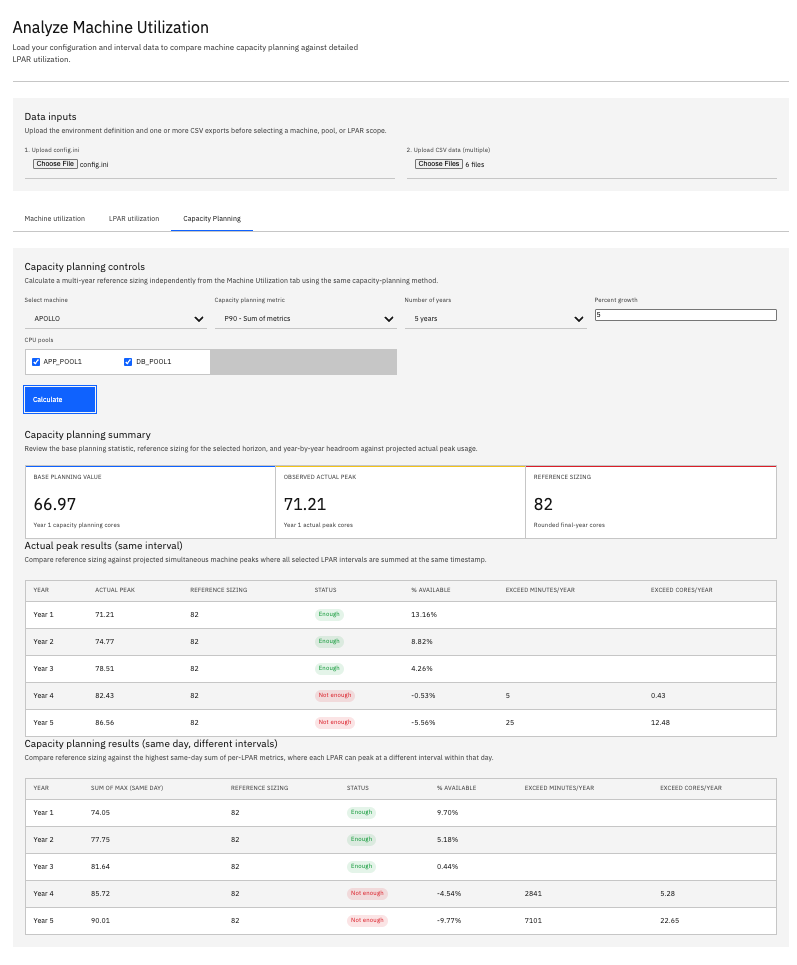
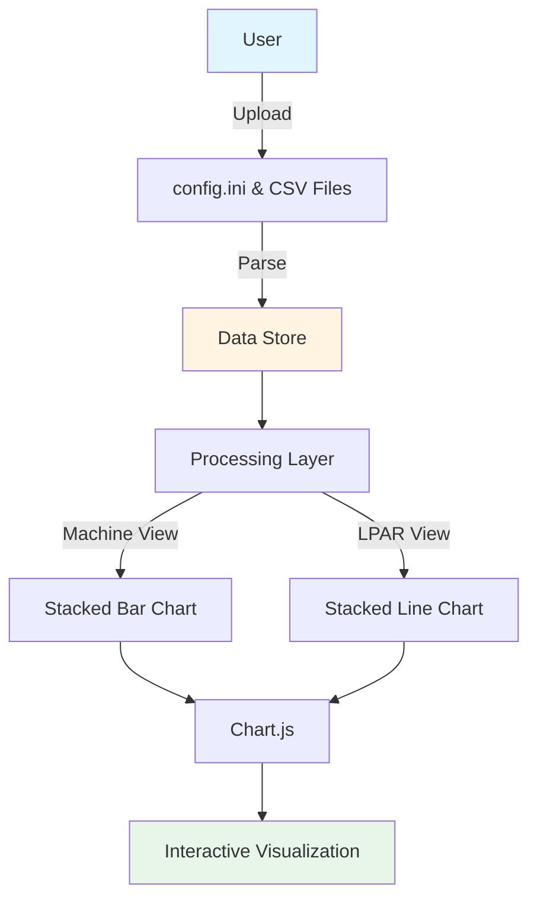

# CPU Utilization Visualizer
- [CPU Utilization Visualizer](#cpu-utilization-visualizer)
  - [Description](#description)
  - [Disclaimer](#disclaimer)
  - [Development](#development)
  - [Project Structure](#project-structure)
  - [Features](#features)
    - [Machine Utilization View](#machine-utilization-view)
    - [LPAR Utilization View](#lpar-utilization-view)
  - [Aggregation Modes](#aggregation-modes)
    - [Capacity Planning (Sum of Metrics) - DEFAULT](#capacity-planning-sum-of-metrics---default)
    - [Actual Usage (Metric of Sums)](#actual-usage-metric-of-sums)
    - [Key Differences](#key-differences)
    - [Example Scenario](#example-scenario)
    - [Configuration Example](#configuration-example)
    - [References](#references)
  - [UI Updates](#ui-updates)
  - [Screenshots](#screenshots)
    - [Machine CPU Utilization (Sum by Pool)](#machine-cpu-utilization-sum-by-pool)
      - [Overall](#overall)
      - [Graph](#graph)
      - [Select date range](#select-date-range)
    - [LPAR CPU Utilization (by Date)](#lpar-cpu-utilization-by-date)
      - [Overall](#overall-1)
      - [Graph](#graph-1)
    - [Capacity Planning with Percentile](#capacity-planning-with-percentile)
    - [Dark Mode](#dark-mode)
  - [How to Use](#how-to-use)
  - [Data Formats](#data-formats)
    - [`config.ini`](#configini)
    - [CSV Performance Data](#csv-performance-data)
    - [Supported Date Formats](#supported-date-formats)
  - [Example Data Generation (Python)](#example-data-generation-python)
  - [Architecture](#architecture)
  - [Technologies Used](#technologies-used)
  - [Percentile Calculation Methods](#percentile-calculation-methods)
    - [Overview](#overview)
    - [PERCENTILE.INC (Inclusive Method)](#percentileinc-inclusive-method)
    - [PERCENTILE.EXC (Exclusive Method)](#percentileexc-exclusive-method)
    - [Comparison Table](#comparison-table)
    - [Which Method to Choose?](#which-method-to-choose)
    - [Practical Example with CPU Data](#practical-example-with-cpu-data)


## Description

A single-page web application designed for the visualization of historical CPU utilization data. Initially conceived for IBM Power Systems (Logical Partitions), this tool can be readily adapted to accommodate other virtualization platforms as well.

The application facilitates the analysis of CPU usage patterns across multiple LPARs or Virtual Machines on physical hardware, organized by CPU Pools.

## Disclaimer

This application and repository are community-created utilities inspired by IBM design language for interface styling only. They are not official IBM software, products, services, or support offerings, and they are not affiliated with, endorsed by, or maintained by IBM.

## Development

The project is designed to be self-contained within `visualizer.html`, making it easy to deploy and use locally. All processing happens client-side in the browser with no server dependencies.

## Project Structure
 
```
cpu-utilization-visualizer/
├── visualizer.html           # Main application file
├── config.ini                # Machine and CPU Pool configuration
├── generate_cpu_data.py      # Create sample data for testing
├── data/                     # Sample of CSV files containing CPU utilization data
│   ├── lpar1.csv
│   ├── lpar2.csv
│   └── ...
├── DATA_GENERATOR_GUIDE.md   # Data Generator Guide
└── README.md                 # This file
```

## Features

-   **Browser-based SPA:** Runs entirely in your web browser, no server-side setup required.
-   **Data Ingestion:** Upload `config.ini` for machine and LPAR pool definitions, and multiple CSV files for LPAR performance data.
-   **Flexible Date Formats:** Supports multiple date formats in CSV files (MM/DD/YYYY, DD/MM/YYYY, YYYY-MM-DD, etc.), configurable via `config.ini`. See [Supported Date Formats](#supported-date-formats) for details.
-   **Date Range Filtering:** Select specific date ranges for analysis in both Machine and LPAR Utilization views using calendar widgets.
-   **Configurable Standby LPARs:** LPARs defined in `config.ini` but without corresponding CSV data are treated as standby, using a configurable default CPU core value (defaulting to 0.1).
-   **Percentile Calculation:** Supports both Inclusive (INC) and Exclusive (EXC) methods for percentile calculations, configurable via `config.ini`. See [Percentile Calculation Methods](#percentile-calculation-methods) for details.

### Machine Utilization View

-   **Stacked Bar Chart:** Visualizes daily CPU utilization for a selected machine, stacked by CPU pool.
-   **Date Range Selection:** Filter data by selecting start and end dates using calendar widgets. Default shows full date range (oldest to newest date).
-   **Metric Selection:** Choose between Max, Average, or various Percentiles (P50, P60, P70, P80, P90, P95) for daily aggregation.
-   **Aggregation Mode:** Select between two calculation methods (see [Aggregation Modes](#aggregation-modes) below).
-   **Pool Toggling:** Dynamically show/hide individual CPU pools on the chart.
-   **Summary Dashboard:** Displays the minimum and maximum total daily CPU cores across the selected date range for the chosen machine and metric, along with per-pool min/max statistics.
-   **Capacity Exceed Statistics:** When using percentile metrics with Capacity Planning mode, calculate and display statistics for intervals where actual usage exceeds the maximum capacity planning threshold:
    -   **Total Minutes Exceeding:** Total time (in minutes) where actual usage exceeded the capacity threshold
    -   **Days with Exceed:** Number of days containing at least one exceeding interval
    -   **Total Cores Exceeded:** Cumulative sum of cores exceeded across all intervals
    -   **Max Cores Exceeded:** Peak single-interval exceedance (worst moment)

### LPAR Utilization View

-   **Stacked Line Chart:** Shows CPU utilization for selected LPARs with 5-minute interval granularity.
-   **Date Range Selection:** Analyze single or multiple days using start and end date pickers. Default shows oldest date (single day view).
-   **Sequential Multi-Day View:** When multiple dates are selected, displays continuous data from 00:00 of the first day to 23:55 of the last day.
-   **Interactive Tooltips:** Hover over data points to see detailed information including date, time, and CPU core values.
-   **Combined View:** Aggregates and displays the utilization of multiple selected LPARs.
-   **Summary Dashboard:** Provides detailed statistics calculated across all intervals in the selected date range, including Min, Max, Average, P50, P60, P70, P80, P90, and P95.

## Aggregation Modes

The Machine Utilization view offers two distinct calculation methods to serve different analysis purposes:

### Capacity Planning (Sum of Metrics) - DEFAULT

**How it works:**
1. Calculate the selected metric (Max, P95, etc.) for each LPAR individually across all 288 intervals
2. Sum these metrics across all LPARs in each pool
3. Display the total as the pool's value for that day

**Example:**
- LPAR1 peaks at 20 cores (at 10:00 AM)
- LPAR2 peaks at 25 cores (at 3:00 PM)
- **Result: 45 cores**

**Use Cases:**
- ✅ **Hardware Sizing:** "What capacity do I need if each workload hits its typical high usage?"
- ✅ **Budget Planning:** Conservative estimates for infrastructure investment
- ✅ **Capacity Planning:** Accounts for each workload's independent peak patterns
- ✅ **Risk Mitigation:** Ensures headroom for when multiple workloads are busy

**When to use:** Planning new hardware purchases, justifying capacity requirements, or ensuring adequate resources for independent workload peaks.

### Actual Usage (Metric of Sums)

**How it works:**
1. Combine all LPAR values at each 5-minute interval (288 intervals per day)
2. Calculate the selected metric from these combined intervals
3. Display the actual peak/percentile of the combined usage

**Example:**
- LPAR1 peaks at 20 cores (at 10:00 AM)
- LPAR2 peaks at 25 cores (at 3:00 PM)
- At 10:00 AM: LPAR1=20, LPAR2=15 → Combined=35
- At 3:00 PM: LPAR1=10, LPAR2=25 → Combined=35
- **Result: 35 cores** (actual maximum at any single moment)

**Use Cases:**
- ✅ **Utilization Analysis:** "What's the real peak usage across all workloads?"
- ✅ **Waste Identification:** Compare actual usage vs. provisioned capacity
- ✅ **Performance Troubleshooting:** Identify true bottleneck moments
- ✅ **Consolidation Planning:** Understand actual combined resource consumption

**When to use:** Analyzing current utilization, identifying over-provisioning, or understanding real-world resource consumption patterns.

### Key Differences

| Aspect | Capacity Planning | Actual Usage |
|--------|------------------|--------------|
| **Calculation** | Sum of individual metrics | Metric of combined sums |
| **Peak Timing** | Peaks can occur at different times | Peak is at a single moment |
| **Value** | Usually higher | Usually lower (more accurate) |
| **Purpose** | Planning & sizing | Analysis & optimization |
| **Risk** | Conservative (safer) | Realistic (actual) |

### Example Scenario

**Scenario:** You have 3 LPARs on a machine:
- **Payroll LPAR:** Peaks every Friday at 5 PM (P95 = 8 cores)
- **Web Server LPAR:** Peaks Monday mornings (P95 = 6 cores)
- **Database LPAR:** Peaks during month-end (P95 = 10 cores)

**Capacity Planning Mode (P95):**
- Result: 8 + 6 + 10 = **24 cores**
- Interpretation: "I need 24 cores to handle each workload's typical high usage"
- Best for: Sizing a new machine to ensure all workloads have adequate resources

**Actual Usage Mode (P95):**
- Result: **18 cores** (95% of the time, combined usage is below this)
- Interpretation: "These workloads rarely peak together, so 18 cores handles 95% of situations"
- Best for: Understanding current utilization and identifying over-provisioning

**Important Note:** The values in Machine Utilization (Actual Usage mode) will match the LPAR Utilization view when all LPARs are selected for the same date, as both calculate the metric from combined intervals.

### Configuration Example

```ini
[MAIN]
PERCENTILE=INC  ; Use inclusive method (recommended, matches Excel/Google Sheets default)
# PERCENTILE=EXC  ; Use exclusive method (for statistical rigor)
STANDBY=0.1
INTERVAL=5
```

### References

- **Microsoft Excel Documentation:** [PERCENTILE.INC](https://support.microsoft.com/en-us/office/percentile-inc-function-680f9539-45eb-410b-9a5e-c1355e5fe2ed) and [PERCENTILE.EXC](https://support.microsoft.com/en-us/office/percentile-exc-function-bbaa7204-e9e1-4010-85bf-c31dc5dce4ba)
- **Google Sheets Documentation:** [PERCENTILE function](https://support.google.com/docs/answer/3094114)
- **Statistical Theory:** Hyndman, R.J. and Fan, Y. (1996). "Sample Quantiles in Statistical Packages", *The American Statistician*, 50(4), 361-365

## UI Updates

Recent interface updates in [visualizer.html](visualizer.html) include:

- IBM Carbon-inspired light theme structure for layout, spacing, cards, inputs, tabs, and summaries
- Optional dark theme based on the Gray 100 theme guidance in [design.md](design.md) and [design-dark.md](design-dark.md)
- Segmented light/dark switch in the masthead
- Refined summary cards and chart container styling for improved readability
- Preserved original machine stacked-bar and LPAR line-chart color behavior for data clarity

## Screenshots

### Machine CPU Utilization (Sum by Pool)
#### Overall


#### Graph


#### Select date range


### LPAR CPU Utilization (by Date)

#### Overall


#### Graph


### Capacity Planning with Percentile



### Dark Mode


## How to Use

1.  **Open `visualizer.html`:** Simply open the `visualizer.html` file in your web browser (e.g., Chrome, Firefox, Edge).
2.  **Upload `config.ini`:** Click "Upload config.ini" and select your configuration file. This defines your machines, CPU pools, and LPARs.
3.  **Upload CSV Data:** Click "Upload CSV Data (Multiple)" and select all your LPAR performance CSV files.
    *   **CSV File Naming:** Each CSV file should be named after the LPAR (e.g., `lpar1.csv`).
    *   **CSV Content:** Each row represents a day, starting with the date followed by 288 columns of 5-minute interval CPU utilization data (or fewer columns if using a different interval setting).
4.  **Navigate Tabs:** Switch between "Machine Utilization" and "LPAR Utilization" tabs.
5.  **Select Options:** Use the dropdowns and checkboxes to select machines, dates, metrics, and specific LPARs or CPU pools to visualize the data.

## Data Formats

### `config.ini`

-   Sections `[Machine Name]` define machines.
-   Under each machine, `CPU POOL NAME=LPAR1,LPAR2,...` defines pools and their member LPARs.
-   The `[MAIN]` section can define:
    -   `PERCENTILE` (INC/EXC) - Percentile calculation method
    -   `STANDBY` (numeric) - Default CPU cores for LPARs without CSV data
    -   `DATEFORMAT` (string) - Date format in CSV files (default: MM/DD/YYYY)
    -   `INTERVAL` (numeric) - Time interval in minutes (default: 5)
-   Lines starting with # are comments and will be ignored
    *   **Example `config.ini` structure:**
        ```ini
        [MAIN]
        PERCENTILE=INC      ; or EXC
        STANDBY=0.1         ; default value for standby LPARs if no CSV data
        DATEFORMAT=MM/DD/YYYY  ; date format in CSV files (MM/DD/YYYY, DD/MM/YYYY, YYYY-MM-DD, YYYY/MM/DD)
        INTERVAL=5          ; time interval in minutes (5, 10, 15, 30, etc.)
        [MACHINE1]
        POOL1=LPAR1,LPAR3,LPAR5
        POOL2=LPAR7,LPAR9
        [MACHINE2]
        POOL1=LPAR2,LPAR4,LPAR6
        POOL2=LPAR8,LPAR10
        ```

### CSV Performance Data

-   **Filename:** `lparname.csv` (e.g., `lpar1.csv`).
-   **Content:**
    -   First column: Date in the format specified by `DATEFORMAT` in config.ini (default: `MM/DD/YYYY`)
    -   Remaining columns: CPU utilization in cores for each time interval
    -   Number of columns depends on `INTERVAL` setting in config.ini:
        -   5 minutes → 288 columns (default)
        -   10 minutes → 144 columns
        -   15 minutes → 96 columns
        -   30 minutes → 48 columns
    *   **Example CSV structure (5-minute intervals, MM/DD/YYYY format):**
    ```csv
    Date,00:00,00:05,00:10,...,23:50,23:55
    04/01/2026,2.5,2.8,3.1,...,2.2,2.0
    04/02/2026,3.2,3.5,3.8,...,3.0,2.8
    ```
    *   **Example CSV structure (15-minute intervals, DD/MM/YYYY format):**
    ```csv
    Date,00:00,00:15,00:30,...,23:30,23:45
    01/04/2026,2.5,2.8,3.1,...,2.2,2.0
    02/04/2026,3.2,3.5,3.8,...,3.0,2.8
    ```
    *   **Example CSV structure (YYYY-MM-DD format):**
    ```csv
    Date,00:00,00:05,00:10,...,23:50,23:55
    2026-04-01,2.5,2.8,3.1,...,2.2,2.0
    2026-04-02,3.2,3.5,3.8,...,3.0,2.8
    ```

### Supported Date Formats

The `DATEFORMAT` parameter in `config.ini` supports the following formats:
- `MM/DD/YYYY` - Month/Day/Year (default, US format) - e.g., 04/30/2026
- `DD/MM/YYYY` - Day/Month/Year (European format) - e.g., 30/04/2026
- `YYYY-MM-DD` - Year-Month-Day (ISO format) - e.g., 2026-04-30
- `YYYY/MM/DD` - Year/Month/Day - e.g., 2026/04/30
- `MM-DD-YYYY` - Month-Day-Year with dashes - e.g., 04-30-2026
- `DD-MM-YYYY` - Day-Month-Year with dashes - e.g., 30-04-2026

**Note:** All dates are converted internally to MM/DD/YYYY format for consistency.
## Example Data Generation (Python)

 [Data Generator](DATA_GENERATOR_GUIDE.md)

## Architecture



## Technologies Used

-   **HTML5:** Structure of the web page.
-   **CSS3:** Styling and responsive layout.
-   **JavaScript (ES6+):** Core logic for data parsing, calculations, and UI interaction.
-   **Chart.js:** For rendering interactive charts. Loaded via CDN.
-   **Mermaid:** Documentation diagrams (in README).

## Percentile Calculation Methods

This application supports two standard percentile calculation methods, configurable via the `PERCENTILE` setting in [`config.ini`](#configini). Understanding these methods is crucial for accurate capacity planning and performance analysis.

### Overview

A **percentile** is a statistical measure indicating the value below which a given percentage of observations fall. For example, the 95th percentile (P95) is the value below which 95% of the data points lie.

Both methods are widely used in spreadsheet applications and statistical analysis:
- **PERCENTILE.INC** (Inclusive) - Excel, Google Sheets `PERCENTILE` or `PERCENTILE.INC`
- **PERCENTILE.EXC** (Exclusive) - Excel `PERCENTILE.EXC`, Google Sheets `PERCENTILE.EXC`

### PERCENTILE.INC (Inclusive Method)

**Configuration:** Set `PERCENTILE=INC` in `config.ini`

**How it works:**
1. Sort the data in ascending order
2. Calculate position: `k = p × (n - 1) + 1` where:
   - `p` = percentile (e.g., 0.95 for P95)
   - `n` = number of data points
   - `k` = position in sorted array
3. If `k` is a whole number, return the value at position `k`
4. If `k` is fractional, interpolate between the two nearest values

**Example:** Finding P95 of [10, 20, 30, 40, 50, 60, 70, 80, 90, 100]
- n = 10 data points
- k = 0.95 × (10 - 1) + 1 = 9.55
- Interpolate between position 9 (90) and position 10 (100)
- Result: 90 + 0.55 × (100 - 90) = **95.5**

**Characteristics:**
- ✅ Includes both minimum and maximum values in the range
- ✅ Can return the actual minimum (P0) and maximum (P100) values
- ✅ More commonly used in industry and spreadsheet applications
- ✅ Default method in Google Sheets `PERCENTILE()` function
- ✅ Equivalent to Excel's `PERCENTILE()` and `PERCENTILE.INC()`

**Excel/Google Sheets equivalent:**
```excel
=PERCENTILE(A1:A10, 0.95)
=PERCENTILE.INC(A1:A10, 0.95)
```

### PERCENTILE.EXC (Exclusive Method)

**Configuration:** Set `PERCENTILE=EXC` in `config.ini`

**How it works:**
1. Sort the data in ascending order
2. Calculate position: `k = p × (n + 1)` where:
   - `p` = percentile (e.g., 0.95 for P95)
   - `n` = number of data points
   - `k` = position in sorted array
3. If `k` is a whole number, return the value at position `k`
4. If `k` is fractional, interpolate between the two nearest values
5. If `k < 1` or `k > n`, the percentile is undefined

**Example:** Finding P95 of [10, 20, 30, 40, 50, 60, 70, 80, 90, 100]
- n = 10 data points
- k = 0.95 × (10 + 1) = 10.45
- Position exceeds array bounds (k > n)
- Result: **Undefined** (or returns maximum value as fallback)

**Characteristics:**
- ⚠️ Excludes the actual minimum and maximum from the percentile range
- ⚠️ Cannot calculate P0 or P100 (undefined)
- ⚠️ Requires more data points for extreme percentiles
- ✅ Preferred in some statistical contexts for theoretical rigor
- ✅ Equivalent to Excel's `PERCENTILE.EXC()`

**Excel/Google Sheets equivalent:**
```excel
=PERCENTILE.EXC(A1:A10, 0.95)
```
<!-- 
### Statistical Theory -->

**Linear Interpolation:**
Both methods use linear interpolation when the calculated position falls between two data points:

```
value = data[floor(k)] + (k - floor(k)) × (data[ceil(k)] - data[floor(k)])
```

<!-- **Quantile Function:**
Percentiles are specific quantiles of a probability distribution. The kth percentile is the value x such that:

```
P(X ≤ x) = k/100
```

Where X is a random variable representing the data distribution. -->

**Sample vs. Population:**
- **INC method** treats data as a complete population (includes endpoints)
- **EXC method** treats data as a sample from a larger population (excludes endpoints)

### Comparison Table

| Aspect | PERCENTILE.INC | PERCENTILE.EXC |
|--------|----------------|----------------|
| **Formula** | k = p × (n - 1) + 1 | k = p × (n + 1) |
| **Range** | P0 to P100 | P(1/(n+1)) to P(n/(n+1)) |
| **Min/Max** | Can return actual min/max | Cannot return actual min/max |
| **Excel Function** | `PERCENTILE.INC()` | `PERCENTILE.EXC()` |
| **Google Sheets** | `PERCENTILE()` or `PERCENTILE.INC()` | `PERCENTILE.EXC()` |
| **Default in App** | ✅ Recommended | Alternative |
| **Use Case** | General capacity planning | Statistical analysis |

### Which Method to Choose?

**Use PERCENTILE.INC (Recommended) when:**
- ✅ You need consistency with common spreadsheet tools (Excel, Google Sheets default)
- ✅ You want to include actual observed minimum and maximum values
- ✅ You're performing capacity planning or infrastructure sizing
- ✅ You need to compare results with existing reports using standard percentile functions

**Use PERCENTILE.EXC when:**
- ✅ You require strict statistical methodology
- ✅ You're working with sample data representing a larger population
- ✅ You need to match specific statistical software or academic requirements
- ✅ You have a large dataset (n > 100) where the difference is minimal

### Practical Example with CPU Data

Given 288 CPU utilization measurements (5-minute intervals over 24 hours):

**Scenario:** Daily CPU cores = [2.1, 2.3, 2.5, ..., 15.8, ..., 3.2, 2.8]

**PERCENTILE.INC (P95):**
- Position: 0.95 × (288 - 1) + 1 = 273.65
- Interpolate between values at positions 273 and 274
- Result: **~14.2 cores**
- Interpretation: "95% of the time, CPU usage is at or below 14.2 cores"

**PERCENTILE.EXC (P95):**
- Position: 0.95 × (288 + 1) = 274.55
- Interpolate between values at positions 274 and 275
- Result: **~14.3 cores**
- Interpretation: "95% of intervals fall below 14.3 cores (excluding extremes)"

**Difference:** With 288 data points, the difference is typically small (< 1%), but INC is more conservative for capacity planning.