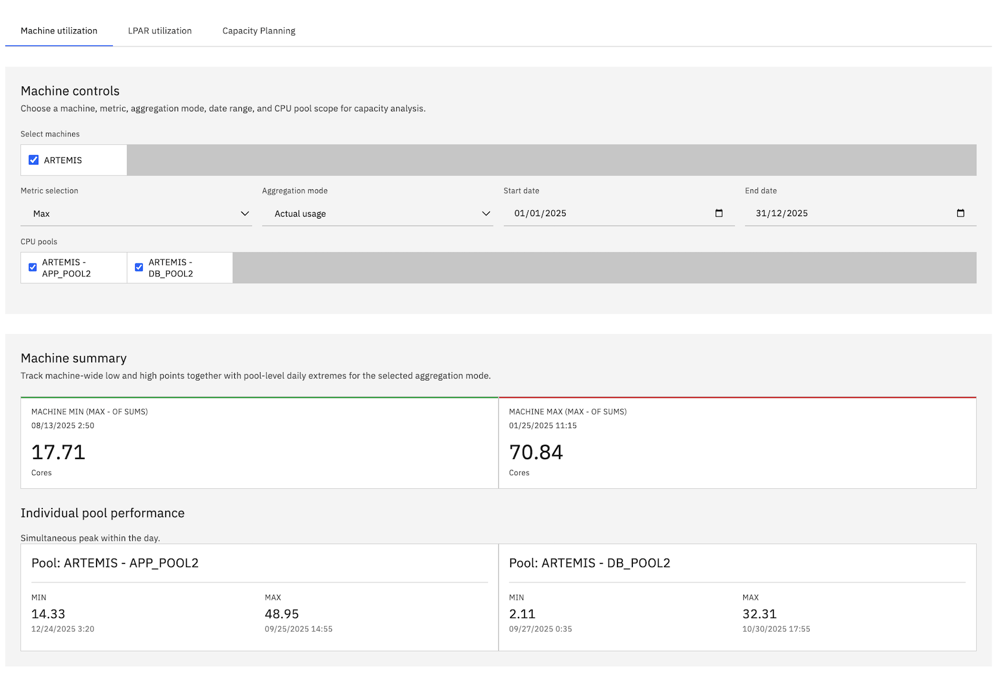
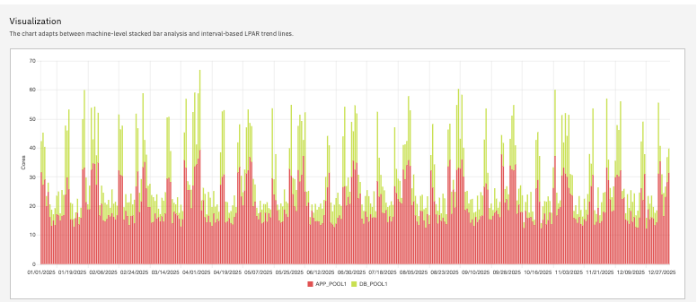
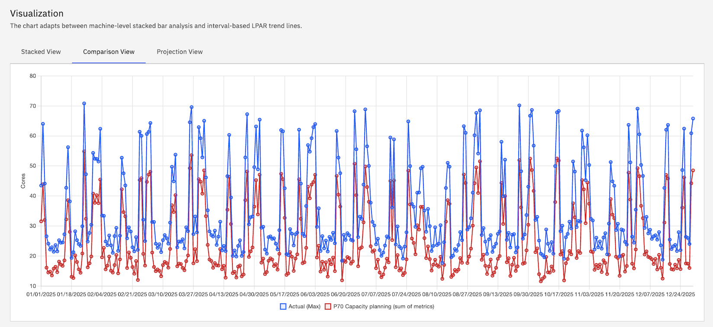
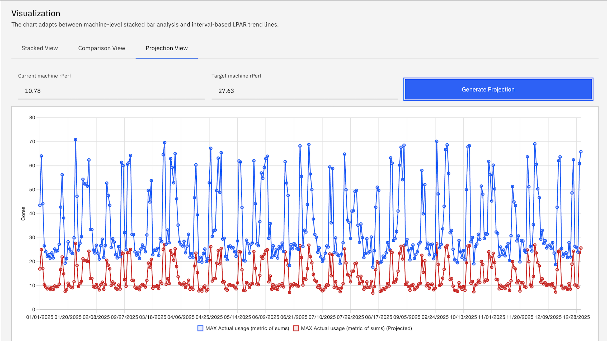
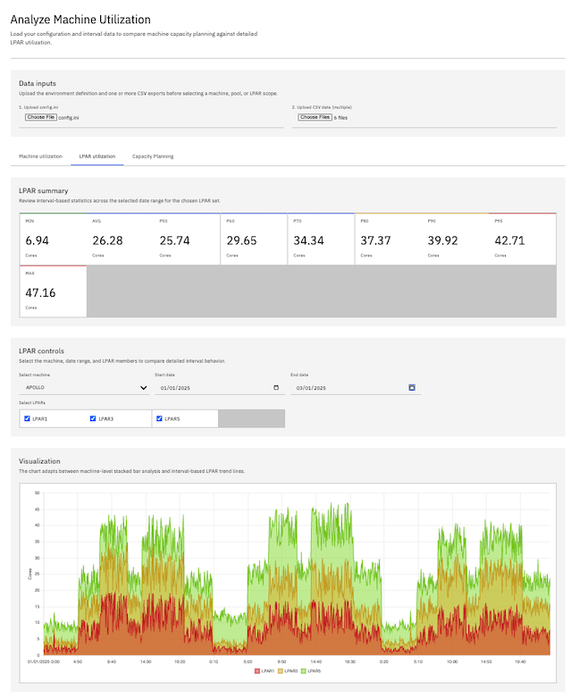
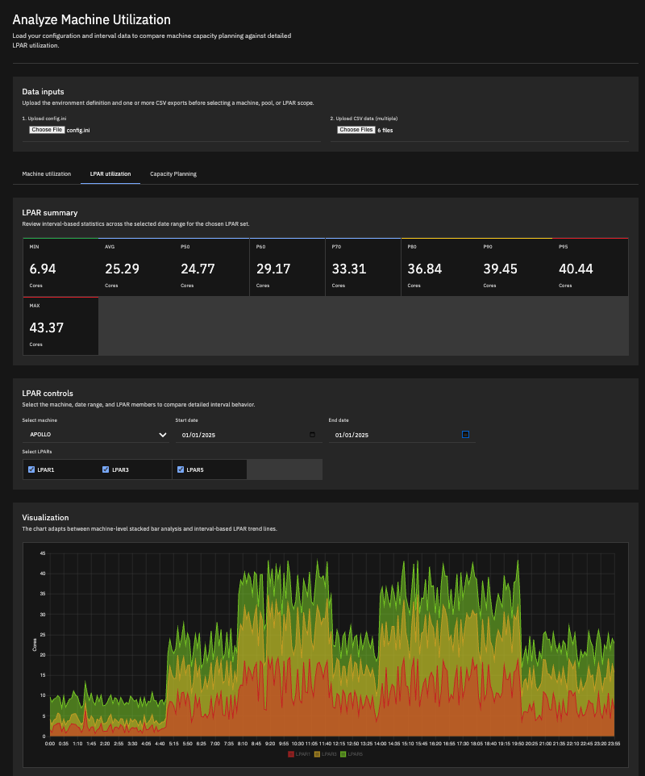

# CPU Utilization Visualizer
- [CPU Utilization Visualizer](#cpu-utilization-visualizer)
  - [Description](#description)
  - [Disclaimer](#disclaimer)
  - [Development](#development)
  - [Project Structure](#project-structure)
  - [Features](#features)
    - [Machine Utilization View](#machine-utilization-view)
    - [LPAR Utilization View](#lpar-utilization-view)
    - [Capacity Planning View](#capacity-planning-view)
  - [Aggregation Modes](#aggregation-modes)
    - [Actual Usage (Metric of Sums)](#actual-usage-metric-of-sums)
    - [Capacity Planning (Sum of Metrics)](#capacity-planning-sum-of-metrics)
    - [Capacity Planning (Sum of Metrics from Different Day)](#capacity-planning-sum-of-metrics-from-different-day)
    - [Key Differences](#key-differences)
    - [Example Scenario](#example-scenario)
    - [Configuration Example](#configuration-example)
    - [References](#references)
  - [UI Updates](#ui-updates)
  - [Screenshots](#screenshots)
    - [Machine CPU Utilization (Sum by Pool)](#machine-cpu-utilization-sum-by-pool)
      - [Overall](#overall)
      - [Graph](#graph)
    - [Comparison](#comparison)
    - [Projection](#projection)
    - [LPAR CPU Utilization (by Date)](#lpar-cpu-utilization-by-date)
    - [Capacity Planning with Percentile](#capacity-planning-with-percentile)
    - [Dark Mode](#dark-mode)
  - [How to Use](#how-to-use)
  - [Data Formats](#data-formats)
    - [`config.ini`](#configini)
    - [CSV Performance Data](#csv-performance-data)
    - [Supported Date Formats](#supported-date-formats)
  - [Capacity Planning Analysis Script](#capacity-planning-analysis-script)
    - [analyze\_exceedance.py](#analyze_exceedancepy)
  - [Example Data Generation (Python)](#example-data-generation-python)
  - [Architecture](#architecture)
  - [Technologies Used](#technologies-used)
  - [Percentile Calculation Methods](#percentile-calculation-methods)
    - [Overview](#overview)
    - [How interpolation works](#how-interpolation-works)
    - [PERCENTILE.INC (Inclusive Method)](#percentileinc-inclusive-method)
    - [PERCENTILE.EXC (Exclusive Method)](#percentileexc-exclusive-method)
    - [Key difference between INC and EXC](#key-difference-between-inc-and-exc)
    - [Comparison Table](#comparison-table)
    - [Which Method to Choose?](#which-method-to-choose)
    - [Practical Example with CPU Data](#practical-example-with-cpu-data)
      - [Using `INC`](#using-inc)
      - [Using `EXC`](#using-exc)
    - [Practical interpretation for CPU utilization](#practical-interpretation-for-cpu-utilization)


## Description

A single-page web application designed for the visualization of historical CPU utilization data. Initially conceived for IBM Power Systems (Logical Partitions), this tool can be readily adapted to accommodate other virtualization platforms as well.

The application facilitates the analysis of CPU usage patterns across multiple LPARs or Virtual Machines on physical hardware, organized by CPU Pools.

## Disclaimer

This application and repository are community-created utilities inspired by IBM design language for interface styling only. They are not official IBM software, products, services, or support offerings, and they are not affiliated with, endorsed by, or maintained by IBM.

## Development

The project is designed to be self-contained within `visualizer.html`, making it easy to deploy and use locally. All processing happens client-side in the browser with no server dependencies.

## Project Structure
 
```
cpu-utilization-visualizer/
├── visualizer.html           # Main application file
├── analyze_exceedance.py     # Python script for capacity planning analysis
├── config.ini                # Machine and CPU Pool configuration
├── analyzer.ini              # Configuration for analyze_exceedance.py
├── generate_cpu_data.py      # Create sample data for testing
├── data/                     # Sample of CSV files containing CPU utilization data
│   ├── lpar1.csv
│   ├── lpar2.csv
│   └── ...
├── DATA_GENERATOR_GUIDE.md   # Data Generator Guide
└── README.md                 # This file
```

## Features

-   **Browser-based SPA:** Runs entirely in your web browser, no server-side setup required.
-   **Data Ingestion:** Upload `config.ini` for machine and LPAR pool definitions, and multiple CSV files for LPAR performance data.
-   **Flexible Date Formats:** Supports multiple date formats in CSV files (MM/DD/YYYY, DD/MM/YYYY, YYYY-MM-DD, etc.), configurable via `config.ini`. See [Supported Date Formats](#supported-date-formats) for details.
-   **Date Range Filtering:** Select specific date ranges for analysis in both Machine and LPAR Utilization views using calendar widgets.
-   **Configurable Standby LPARs:** LPARs defined in `config.ini` but without corresponding CSV data are treated as standby, using a configurable default CPU core value (defaulting to 0.1).
-   **Percentile Calculation:** Supports both Inclusive (INC) and Exclusive (EXC) methods for percentile calculations, configurable via `config.ini`. See [Percentile Calculation Methods](#percentile-calculation-methods) for details.

### Machine Utilization View

-   **Triple Visualization Modes:**
    -   **Stacked View:** Traditional stacked bar chart showing daily CPU utilization by pool with tooltip showing total cores
    -   **Comparison View:** Line graph comparing actual maximum usage against selected metric (e.g., P90, P95) with chosen aggregation method
    -   **Projection View:** Line graph showing capacity projection based on machine rPerf values, displaying both current metric values and projected values for target machine performance
-   **Date Range Selection:** Filter data by selecting start and end dates using calendar widgets. Default shows full date range (oldest to newest date).
-   **Metric Selection:** Choose between Max, Average, or various Percentiles (P50, P60, P70, P80, P90, P95) for daily aggregation.
-   **Aggregation Mode:** Select between Actual Usage, Capacity Planning (same day), and Capacity Planning (different day) calculation methods (see [Aggregation Modes](#aggregation-modes) below).
-   **Pool Toggling:** Dynamically show/hide individual CPU pools on the chart.
-   **Summary Dashboard:** Displays the minimum and maximum total daily CPU cores across the selected date range for the chosen machine and metric, along with per-pool min/max statistics.
-   **Capacity Exceed Statistics:** When using percentile metrics with Capacity Planning mode, calculate and display statistics for intervals where actual usage exceeds the maximum capacity planning threshold:
    -   **Total Minutes Exceeding:** Total time (in minutes) where actual usage exceeded the capacity threshold
    -   **Days with Exceed:** Number of days containing at least one exceeding interval
    -   **Total Cores Exceeded:** Cumulative sum of cores exceeded across all intervals
    -   **Max Cores Exceeded:** Peak single-interval exceedance (worst moment)
-   **Projection View Features:**
    -   **rPerf-Based Projection:** Input current and target machine rPerf values to project capacity requirements
    -   **Numeric Validation:** Accepts decimal values (e.g., 10.78, 27.3) for precise rPerf specifications
    -   **Dynamic Calculation:** Projection multiplier = current rPerf / target rPerf, applied to selected metric values
    -   **Dual-Line Visualization:** Shows both original metric values and projected values on the same line chart
    -   **On-Demand Generation:** Chart updates only when "Generate Projection" button is clicked, clearing when metric or aggregation changes

### LPAR Utilization View

-   **Stacked Line Chart:** Shows CPU utilization for selected LPARs with 5-minute interval granularity, stacked so the visible top boundary matches the combined total shown in the summary.
-   **Date Range Selection:** Analyze single or multiple days using start and end date pickers. Default shows oldest date (single day view).
-   **Sequential Multi-Day View:** When multiple dates are selected, displays continuous data from 00:00 of the first day to 23:55 of the last day.
-   **Interactive Tooltips:** Hover over data points to see detailed information including date, time, and CPU core values.
-   **Combined View:** Aggregates and displays the utilization of multiple selected LPARs.
-   **Summary Dashboard:** Provides detailed statistics calculated across all intervals in the selected date range, including Min, Max, Average, P50, P60, P70, P80, P90, and P95.

### Capacity Planning View

-   **Multi-Machine Selection:** Select one or multiple machines for combined capacity planning analysis. When multiple machines are selected, reference sizing and CPU utilization are summed across all selected machines.
-   **Dynamic Pool Selection:** CPU pools are displayed for all selected machines in the format "Machine - Pool" (e.g., "P780#1 - IST1", "P780#2 - IST2"), allowing granular control over which pools to include in calculations.
-   **Independent Planning Workflow:** Runs separately from the exceeded-capacity calculation in the Machine Utilization view while reusing the same combined-interval capacity-planning logic.
-   **Metric Selection:** Choose paired same-day and different-day planning metrics for Max, P95, P90, and P80, plus single-mode P50 and Average, as the first-year planning baseline.
-   **Growth Inputs:** Provide separate growth rates for base planning and CPU utilization, plus a planning duration from 1 to 5 years. Results render the same number of yearly rows as the selected duration.
-   **Reference Sizing Calculation:** Builds a fixed final-year reference sizing by compounding the base planning growth rate from the first-year capacity planning value (summed across selected machines), then rounds the result up to the next whole core.
-   **Multi-Machine Calculations:**
    -   Base planning values are summed across all selected machines and their selected pools
    -   Observed actual peak values are summed across all selected machines and their selected pools
    -   CPU utilization growth is applied to the combined actual peak for year-by-year projections
-   **Results Table:** Shows yearly output comparing projected **Actual peak** against **Reference sizing** with `Exceed Minutes/year` and `Exceed Cores/year` when status is `Not enough`.
-   **Annualized Exceedance Projection:** `Exceed Minutes/year` and `Exceed Cores/year` are annualized to a 365-day year using the combined-interval actual-usage method across all selected machines and pools.
-   **Availability Summary:** Shows base planning value, observed actual peak, reference sizing, yearly sizing sufficiency, and available percentage in Carbon-style result tables. All values reflect the sum across selected machines.

## Aggregation Modes

The Machine Utilization view offers three distinct calculation methods to serve different analysis purposes:

### Actual Usage (Metric of Sums)

**How it works:**
1. Combine all LPAR values at each 5-minute interval for the selected day
2. Calculate the selected metric from these combined intervals
3. Display the actual peak/percentile of the combined usage

**Example:**
- LPAR1 peaks at 20 cores (at 10:00 AM)
- LPAR2 peaks at 25 cores (at 3:00 PM)
- At 10:00 AM: LPAR1=20, LPAR2=15 → Combined=35
- At 3:00 PM: LPAR1=10, LPAR2=25 → Combined=35
- **Result: 35 cores** (actual maximum at a single moment)

**Use Cases:**
- ✅ **Utilization Analysis:** "What's the real simultaneous peak usage across all workloads?"
- ✅ **Waste Identification:** Compare actual usage vs. provisioned capacity
- ✅ **Performance Troubleshooting:** Identify true bottleneck moments
- ✅ **Consolidation Planning:** Understand actual combined resource consumption

**When to use:** Analyzing current utilization, identifying over-provisioning, or understanding real-world simultaneous resource consumption patterns.

### Capacity Planning (Sum of Metrics)

**How it works:**
1. Calculate the selected metric (Max, P95, P90, or P80) for each LPAR individually across all 288 intervals within the same day
2. Sum these metrics across all LPARs in each pool
3. Sum the pool values to produce a machine daily value
4. Take the highest machine daily value across the selected date range

**Important timing note:** The result comes from a single day, but each LPAR maximum can come from different intervals within that day.

**Example:**
- LPAR1 peaks at 20 cores (at 10:00 AM)
- LPAR2 peaks at 25 cores (at 3:00 PM)
- **Result: 45 cores** on that day

**Use Cases:**
- ✅ **Hardware Sizing:** "What capacity do I need if each workload hits its typical high usage on the same day?"
- ✅ **Budget Planning:** Conservative estimates for infrastructure investment
- ✅ **Capacity Planning:** Accounts for each workload's independent peak patterns within the same day
- ✅ **Risk Mitigation:** Ensures headroom for busy days even if peaks do not occur at the same time

**When to use:** Planning new hardware purchases when workloads are expected to be busy on the same day.

### Capacity Planning (Sum of Metrics from Different Day)

**How it works:**
1. Calculate the selected metric (Max, P95, P90, or P80) for each LPAR individually for each day
2. Sum those values within each pool for each day
3. Find the best day independently for each pool
4. Sum each pool's independent best-day value into a machine total

**Important timing note:** The result can combine different days across pools, and different intervals within those days.

**Example:**
- IST1 best day = 40.66
- WASND1 best day = 1.30
- DEFAULT1 best day = 4.00
- **Result: 45.96** even if those peaks do not occur on the same day

**Use Cases:**
- ✅ **Aggressive Sizing Envelope:** "What if each pool gets to contribute its own best day?"
- ✅ **Worst-Case Consolidation Estimate:** Size for independently peaked pools
- ✅ **Scenario Comparison:** Compare same-day planning vs. different-day planning assumptions

**When to use:** Evaluating a more conservative sizing envelope where each pool can contribute its own best day independently.

### Key Differences

| Aspect | Actual Usage | Capacity Planning (same day) | Capacity Planning (different day) |
|--------|--------------|------------------------------|-----------------------------------|
| **Calculation** | Metric of combined sums | Sum of individual metrics on the same day | Sum of each pool's best day |
| **Peak Timing** | Single interval | Single day, multiple intervals | Different days and different intervals |
| **Value** | Usually lowest | Usually higher | Usually highest |
| **Purpose** | Analysis & optimization | Planning & sizing | Conservative envelope planning |
| **Risk** | Realistic (actual) | Conservative | Most conservative |

### Example Scenario

**Scenario:** You have 3 LPARs on a machine:
- **Payroll LPAR:** Peaks every Friday at 5 PM (P95 = 8 cores)
- **Web Server LPAR:** Peaks Monday mornings (P95 = 6 cores)
- **Database LPAR:** Peaks during month-end (P95 = 10 cores)

**Actual Usage Mode (P95):**
- Result: **18 cores** (95% of the time, combined usage is below this)
- Interpretation: "These workloads rarely peak together, so 18 cores handles 95% of situations"
- Best for: Understanding current utilization and identifying over-provisioning

**Capacity Planning Mode (P95 - same day):**
- Result: 8 + 6 + 10 = **24 cores**
- Interpretation: "I need 24 cores to handle each workload's typical high usage on a busy day"
- Best for: Sizing a new machine to ensure all workloads have adequate resources on the same day

**Capacity Planning Mode (P95 - different day):**
- Result: can be **24 cores or higher** if each pool contributes its own best day independently
- Interpretation: "I want a sizing envelope based on independent pool best days"
- Best for: Comparing a more conservative planning scenario against the same-day assumption

**Important Note:** The values in Machine Utilization `Actual Usage` mode will match the stacked LPAR Utilization view when all LPARs are selected for the same date, as both calculate the metric from combined intervals.

### Configuration Example

```ini
[MAIN]
PERCENTILE=INC  ; Use inclusive method (recommended, matches Excel/Google Sheets default)
# PERCENTILE=EXC  ; Use exclusive method (for statistical rigor)
STANDBY=0.1
INTERVAL=5
```

### References

- **Microsoft Excel Documentation:** [PERCENTILE.INC](https://support.microsoft.com/en-us/office/percentile-inc-function-680f9539-45eb-410b-9a5e-c1355e5fe2ed) and [PERCENTILE.EXC](https://support.microsoft.com/en-us/office/percentile-exc-function-bbaa7204-e9e1-4010-85bf-c31dc5dce4ba)
- **Google Sheets Documentation:** [PERCENTILE function](https://support.google.com/docs/answer/3094114)
- **Statistical Theory:** Hyndman, R.J. and Fan, Y. (1996). "Sample Quantiles in Statistical Packages", *The American Statistician*, 50(4), 361-365

## Metric Max Calculation with Aggregation Methods

This section explains how metric max (and other metrics) are calculated with different aggregation methods for dashboard and graph display.

### Available Metrics

The system supports multiple metrics for analysis:
- **Max**: Maximum value across all intervals
- **P95, P90, P80, P70, P60, P50**: Percentile values
- **Avg**: Average value across all intervals

### Detailed Aggregation Method Calculations

#### 1. Actual Usage (Real Peak)

Calculates the metric from combined intervals to show the actual simultaneous peak usage.

**Algorithm:**
```javascript
// Step 1: Combine all LPAR intervals for each time slot
combined = Array(intervalsPerDay).fill(0)
for each LPAR:
    intervals = getLparStats(lpar, date).intervals
    for each interval i:
        combined[i] += intervals[i]

// Step 2: Calculate metric from combined intervals
if metric === "Max":
    result = Math.max(...combined)
else if metric === "Avg":
    result = sum(combined) / intervalsPerDay
else if metric.startsWith('p'):
    result = calculatePercentile(combined, percentile/100)
```

**Use Case:** Shows the actual simultaneous peak usage across all LPARs at the same moment in time. This is the most accurate representation of real resource consumption.

**Example:**
```
Time 10:00 - LPAR1: 8.5, LPAR2: 7.2, LPAR3: 6.8 → Combined: 22.5
Time 10:05 - LPAR1: 9.0, LPAR2: 6.8, LPAR3: 7.1 → Combined: 22.9
Time 10:10 - LPAR1: 8.2, LPAR2: 7.5, LPAR3: 6.5 → Combined: 22.2

Max = 22.9 cores (at 10:05)
```

#### 2. Capacity Planning (Sum of Metrics - Same Day)

Sums each LPAR's metric calculated independently, where peaks can occur at different times within the same day.

**Algorithm:**
```javascript
// Step 1: Calculate metric for each LPAR independently
dailyValue = 0
for each LPAR in pool:
    intervals = getLparStats(lpar, date).intervals
    
    if metric === "Max":
        lparMetric = Math.max(...intervals)
    else if metric === "Avg":
        lparMetric = sum(intervals) / intervalsPerDay
    else if metric.startsWith('p'):
        lparMetric = calculatePercentile(intervals, percentile/100)
    
    dailyValue += lparMetric
```

**Use Case:** Capacity planning where each LPAR's peak might occur at different times on the same day. Provides a more conservative estimate than actual usage.

**Example:**
```
LPAR1: Max = 9.0 cores (at 10:05)
LPAR2: Max = 7.5 cores (at 14:30)
LPAR3: Max = 7.1 cores (at 16:45)

Total = 9.0 + 7.5 + 7.1 = 23.6 cores
```

**Note:** This is higher than actual usage (22.9) because the peaks don't occur simultaneously.

#### 3. Capacity Planning (LPAR Daily Metric)

Similar to method 2, but explicitly uses LPAR-level daily metrics before summing.

**Algorithm:**
```javascript
// Calculate each LPAR's daily metric, then sum
dailyValue = 0
for each LPAR:
    intervals = getLparStats(lpar, date).intervals
    lparDailyMetric = calculateMetric(intervals, metric)
    dailyValue += lparDailyMetric
```

**Use Case:** Ensures consistent LPAR-level metric calculation before aggregation.

#### 4. Capacity Planning (Different Day - Pool Level)

Sums each pool's best metric across different days - the most conservative pool-based approach.

**Algorithm:**
```javascript
// Step 1: Find best day for each pool independently
totalPlanning = 0
for each pool:
    poolDailyValues = []
    for each date:
        poolDayValue = 0
        for each LPAR in pool:
            intervals = getLparStats(lpar, date).intervals
            poolDayValue += calculateMetric(intervals, metric)
        poolDailyValues.push(poolDayValue)
    
    // Step 2: Take the maximum day for this pool
    totalPlanning += Math.max(...poolDailyValues)
```

**Use Case:** Conservative capacity planning where each pool's peak can occur on different days.

**Example:**
```
IST1 Pool:
  - Day 1: 38.5 cores
  - Day 2: 40.66 cores ← Best day
  - Day 3: 39.2 cores

WASND1 Pool:
  - Day 1: 1.30 cores ← Best day
  - Day 2: 1.15 cores
  - Day 3: 1.20 cores

Total = 40.66 + 1.30 = 41.96 cores
```

#### 5. Capacity Planning (Different Day - LPAR Level)

Sums each LPAR's best metric across different days - the most conservative LPAR-based approach.

**Algorithm:**
```javascript
// Find best day for each LPAR independently
totalPlanning = 0
for each LPAR:
    lparDailyValues = []
    for each date:
        intervals = getLparStats(lpar, date).intervals
        lparMetric = calculateMetric(intervals, metric)
        lparDailyValues.push(lparMetric)
    
    // Take the maximum day for this LPAR
    totalPlanning += Math.max(...lparDailyValues)
```

**Use Case:** Most conservative approach - each LPAR's individual peak across all days, regardless of when they occur.

### Dashboard Display Calculations

#### Machine Summary Statistics

```javascript
// Calculate daily values for the selected date range
machineDaily = dates.map(date => {
    combined = Array(intervalsPerDay).fill(0)
    
    for each pool in selected pools:
        for each LPAR in pool:
            intervals = getLparStats(lpar, date).intervals
            for each interval i:
                combined[i] += intervals[i]
    
    return calculateMetric(combined, selectedMetric)
})

// Display statistics
Machine Min = Math.min(...machineDaily)
Machine Max = Math.max(...machineDaily)
```

#### Pool Breakdown Statistics

```javascript
// For each pool, calculate daily values
poolDaily = dates.map(date => {
    combined = Array(intervalsPerDay).fill(0)
    
    for each LPAR in pool:
        intervals = getLparStats(lpar, date).intervals
        for each interval i:
            combined[i] += intervals[i]
    
    return calculateMetric(combined, selectedMetric)
})

Pool Min = Math.min(...poolDaily)
Pool Max = Math.max(...poolDaily)
```

### Graph Visualization

#### Stacked Bar Chart (Actual Usage)
- Each bar shows the simultaneous peak for that day
- Pools are stacked to show their contribution at the machine's peak interval
- Ensures accurate representation of actual concurrent usage
- The visible top of the stacked bars matches the machine total

#### Stacked Bar Chart (Capacity Planning)
- Each bar shows the sum of independent pool/LPAR metrics
- May exceed actual usage since peaks can occur at different times
- Used for conservative capacity planning
- Each pool's contribution is its independent metric for that day

### Key Formulas

#### Percentile Calculation (INC method)
```javascript
sortedArray = sort(intervals)
index = (sortedArray.length - 1) * percentile
lower = Math.floor(index)
upper = Math.ceil(index)
weight = index - lower
result = sortedArray[lower] * (1 - weight) + sortedArray[upper] * weight
```

#### Max Calculation
```javascript
max = Math.max(...intervals)
```

#### Average Calculation
```javascript
avg = sum(intervals) / intervals.length
```

### Comparison of Methods

| Method | Timing | Value Relative | Best For |
|--------|--------|----------------|----------|
| Actual Usage | Same interval | Lowest (realistic) | Current utilization analysis |
| Capacity Planning (same day) | Same day, different intervals | Medium | Hardware sizing for busy days |
| Capacity Planning (different day - pool) | Different days per pool | Higher | Conservative pool-based planning |
| Capacity Planning (different day - LPAR) | Different days per LPAR | Highest (most conservative) | Maximum envelope planning |

### Practical Example

**Scenario:** 3 LPARs with 5-minute intervals on 10/1/2025

**Raw Data:**
```
Time    LPAR1   LPAR2   LPAR3
10:00   8.5     7.2     6.8
10:05   9.0     6.8     7.1
10:10   8.2     7.5     6.5
...
14:30   8.0     7.5     6.9
16:45   7.8     7.0     7.1
```

**Actual Usage (Max):**
```
Combined[10:00] = 8.5 + 7.2 + 6.8 = 22.5
Combined[10:05] = 9.0 + 6.8 + 7.1 = 22.9 ← Maximum
Combined[10:10] = 8.2 + 7.5 + 6.5 = 22.2
...
Result: 22.9 cores (at 10:05)
```

**Capacity Planning (Max - same day):**
```
LPAR1 Max = 9.0 (at 10:05)
LPAR2 Max = 7.5 (at 14:30)
LPAR3 Max = 7.1 (at 16:45)
Result: 9.0 + 7.5 + 7.1 = 23.6 cores
```

**Difference:** 23.6 - 22.9 = 0.7 cores represents the capacity buffer needed when peaks don't align.

### Best Practices

1. **For Real-Time Monitoring:** Use "Actual Usage" with "Max" metric
2. **For Capacity Planning:** Use "Capacity Planning (sum of metrics)" with P95 or Max
3. **For Conservative Planning:** Use "Capacity Planning (different day)" methods
4. **For Trend Analysis:** Use date range filters to focus on specific periods
5. **For Exceedance Analysis:** Use percentile metrics (P90, P95) with capacity planning modes

### When to Use Each Method

- **Actual Usage**: Understanding current utilization, identifying over-provisioning, performance troubleshooting
- **Capacity Planning (same day)**: Sizing new hardware when workloads are expected to be busy on the same day
- **Capacity Planning (different day - pool)**: Evaluating conservative sizing where each pool can contribute its best day
- **Capacity Planning (different day - LPAR)**: Maximum envelope planning where each LPAR can peak independently across different days

## UI Updates

Recent interface updates in [visualizer.html](visualizer.html) include:

- IBM Carbon-inspired light theme structure for layout, spacing, cards, inputs, tabs, summaries, and tabular outputs
- Optional dark theme based on the Gray 100 theme guidance in [design.md](design.md) and [design-dark.md](design-dark.md)
- Segmented light/dark switch in the masthead
- Refined summary cards, comparison tables, and chart container styling for improved readability
- Added a Capacity Planning tab for multi-year reference sizing and projected peak sufficiency analysis with separate yearly results for actual peak and same-day sum-of-max comparisons
- Added a third Machine Utilization aggregation mode for `Capacity Planning (sum of metrics from different day)` and hides the machine chart for that mode
- Updated Machine Utilization summary labels to distinguish `Single day, multiple intervals` from simultaneous peaks
- Updated LPAR visualization to stacked rendering so the visible chart top matches the combined summary total
- **Added Machine Utilization Comparison View:** New visualization sub-tab that displays a line graph comparing actual maximum usage against selected metric (P90, P95, Max, etc.) with chosen aggregation method, making it easier to visualize capacity planning thresholds versus actual usage patterns
- **Added Machine Utilization Projection View:** New visualization sub-tab for rPerf-based capacity projection analysis:
  - Input current and target machine rPerf values (e.g., 10.78, 27.3)
  - Calculates projected capacity using formula: metric × (current rPerf / target rPerf)
  - Displays line chart with both original and projected metric values
  - Validates numeric inputs and clears chart when metric/aggregation changes
  - Useful for sizing workloads when migrating between machines with different performance characteristics
- Enhanced tooltips in Machine Utilization stacked view to show total cores when hovering over bars
- Preserved original machine stacked-bar and LPAR line-chart color behavior for data clarity

## Screenshots

### Machine CPU Utilization (Sum by Pool)
#### Overall



#### Graph



### Comparison



### Projection



### LPAR CPU Utilization (by Date)



### Capacity Planning with Percentile


### Dark Mode



## How to Use

1. Open `visualizer.html` in a modern web browser.
2. Upload your `config.ini` file using the file picker.
3. Upload one or more CSV performance files.
4. Use the tabs to switch between Machine Utilization, LPAR Utilization, and Capacity Planning views.
5. Adjust metrics, date ranges, pools, growth rate, and planning years to explore results.

## Data Formats

### `config.ini`

The INI file configures global behavior and machine/pool-to-LPAR mappings.

Example:

```ini
[MAIN]
PERCENTILE=INC # or EXC
INTERVAL=5 # minutes
DATEFORMAT=MM/DD/YYYY # Supported formats: MM/DD/YYYY, DD/MM/YYYY, YYYY-MM-DD, YYYY/MM/DD, MM-DD-YYYY, DD-MM-YYYY
[APOLLO] # Machine
APP_POOL1=LPAR1,LPAR3 #POOL = LPAR1,...
DB_POOL1=LPAR5
[ARTEMIS]
APP_POOL2=LPAR2,LPAR4
DB_POOL2=LPAR6
```

### CSV Performance Data

Expected CSV columns:
- `date`
- `time`
- `interval`

Each CSV should contain interval CPU data for a single LPAR (VM) this interval can be configured in ini file

### Supported Date Formats

Supported formats are controlled by `DATE_FORMAT` in `config.ini`, including:
- `MM/DD/YYYY`
- `DD/MM/YYYY`
- `YYYY-MM-DD`

## Capacity Planning Analysis Script

### analyze_exceedance.py

A Python script for detailed capacity planning analysis that generates CSV reports of capacity exceedances.

**Features:**
- Command-line tool with INI file configuration
- Analyzes CPU capacity exceedances year by year
- Generates detailed CSV reports for each year
- Supports inline comments in INI files (everything after `#` is ignored)
- Handles full-year and partial-year data correctly
- Configurable growth rate, planning years, and reference sizing

**Usage:**
```bash
python3 analyze_exceedance.py <config_file.ini>
```

**Example:**
```bash
python3 analyze_exceedance.py analyzer.ini
```

**Configuration File (analyzer.ini):**
```ini
[MAIN]
PERCENTILE=INC          # or EXC
STANDBY=0.1            # Standby LPAR value in cores
INTERVAL=5             # Interval in minutes
DATA_DIR=data-internal # Directory containing CSV files
PERCENT_GROWTH=5       # Growth rate percentage per year
NUM_OF_YEAR=5          # Number of years to analyze
REFERENCE_CORE=47      # Reference sizing in cores

[P780#1]               # Machine name
IST1=UP2SWPD1,UP2SWPD2,UP2SWPD5
WASND1=UP2UIPD1
DEFAULT1=UP2DNPD1,UP2WSPD1,UP2DDPD1
```

**Output:**
- Console: Year-by-year summary with raw and annualized values
- CSV files: `exceedances_year1.csv` through `exceedances_yearN.csv`
- Each CSV contains: machine, lpar, date, time, reference_core, actual_core, exceed_core

**Annualization Logic:**
- If data has ≥360 days: No adjustment (factor = 1.0)
- If data has <360 days: Scales up to 360 days (factor = 360/sampled_days)

## Example Data Generation (Python)

Use [`generate_cpu_data.py`](generate_cpu_data.py) to create sample datasets for testing.

## Architecture

- Single-file SPA in [`visualizer.html`](visualizer.html)
- Client-side parsing for INI and CSV inputs
- Chart rendering powered by Chart.js
- Capacity planning and percentile calculations performed in-browser

## Technologies Used

- HTML
- CSS
- JavaScript
- [Chart.js](https://www.chartjs.org/)

## Percentile Calculation Methods

### Overview

The app supports two percentile methods configured by `PERCENTILE=INC|EXC` in [`config.ini`](README.md:298):

- `INC` = inclusive percentile calculation
- `EXC` = exclusive percentile calculation

Both methods first sort the interval values from lowest to highest, then locate the percentile position, and finally use linear interpolation when the percentile falls between two points.

### How interpolation works

Percentiles often land between two actual samples rather than exactly on one of them. When that happens, the app calculates a weighted value between the lower and upper neighbors.

This is implemented in [`calculatePercentile()`](visualizer.html:945):

1. Sort the values
2. Compute the percentile index
3. Find the lower and upper sample positions
4. Interpolate between them using the fractional distance

In code terms:

- the lower index is [`Math.floor(i)`](visualizer.html:950)
- the upper index is [`Math.ceil(i)`](visualizer.html:950)
- the fractional part is [`w = i - l`](visualizer.html:950)
- the result is [`s[l] * (1 - w) + s[u] * w`](visualizer.html:951)

Example:

If the sorted values are `[10, 20, 30, 40]` and the percentile position lands halfway between `20` and `30`, the result is:

- `20 * 0.5 + 30 * 0.5 = 25`

So the returned percentile does not need to be one of the original observed values.

### PERCENTILE.INC (Inclusive Method)

`INC` uses the inclusive rank formula:

- index = `(n - 1) * p`

This matches the behavior in [`calculatePercentile()`](visualizer.html:948) when `percentileMethod !== 'EXC'`.

Meaning:

- `p = 0` maps to the first value
- `p = 1` maps to the last value
- the minimum and maximum are included as valid percentile endpoints

This is why `INC` is usually easier to understand in operational dashboards and why it aligns with common spreadsheet expectations.

### PERCENTILE.EXC (Exclusive Method)

`EXC` uses the exclusive rank formula:

- index = `(n + 1) * p - 1`

This matches the behavior in [`calculatePercentile()`](visualizer.html:948) when `percentileMethod === 'EXC'`.

Meaning:

- the percentile is positioned as if the endpoints are outside the main percentile range
- very low and very high percentiles are pushed farther inward
- with small samples, `EXC` can produce more aggressive interpolation near the ends

In strict statistical usage, this can be preferred because it avoids treating the minimum and maximum as full percentile anchors in the same way as `INC`.

### Key difference between INC and EXC

The two methods differ only in how they compute the percentile position before interpolation.

For the same sorted data:

- `INC` tends to stay closer to the endpoints
- `EXC` tends to move percentile positions inward
- the difference becomes more noticeable when:
  - the sample size is small
  - you use extreme percentiles such as `P90`, `P95`, or higher
  - values near the top or bottom are far apart

For large datasets, the difference is usually smaller.

### Comparison Table

| Method | Rank Formula | Endpoint Behavior | Best Fit |
|--------|--------------|-------------------|----------|
| `INC` | `(n - 1) * p` | Includes minimum and maximum as percentile endpoints | Excel/Google Sheets style analysis |
| `EXC` | `(n + 1) * p - 1` | Pushes percentile positions inward from the endpoints | Statistical or stricter sampling workflows |

### Which Method to Choose?

- Use `INC` when you want spreadsheet-compatible results and intuitive business reporting.
- Use `EXC` when you want percentile positions that are less anchored to the absolute minimum and maximum.
- For CPU planning, `INC` is often easier to validate against Excel.
- For analytical comparison with statistical tooling, `EXC` may be preferable.

### Practical Example with CPU Data

If combined interval values are `[10, 12, 14, 18, 20]`, then `n = 5`.

For `P90`:

#### Using `INC`

- index = `(5 - 1) * 0.90 = 3.6`
- lower value = `18`
- upper value = `20`
- result = `18 * 0.4 + 20 * 0.6 = 19.2`

#### Using `EXC`

- index = `(5 + 1) * 0.90 - 1 = 4.4`
- this lands above the last usable interval pair, so the implementation returns the last value
- result = `20`

So for the same data:

- `P90 INC = 19.2`
- `P90 EXC = 20`

This shows why `EXC` can produce a higher near-peak threshold in a small dataset.

### Practical interpretation for CPU utilization

- `P50` is the median typical load
- `P80` or `P90` is often useful for planning thresholds
- `P95` is closer to a near-worst-case operating envelope
- the selected percentile method changes the threshold slightly, especially for small daily samples or very spiky workloads

When comparing results with external tools, always make sure they use the same percentile method as the app.