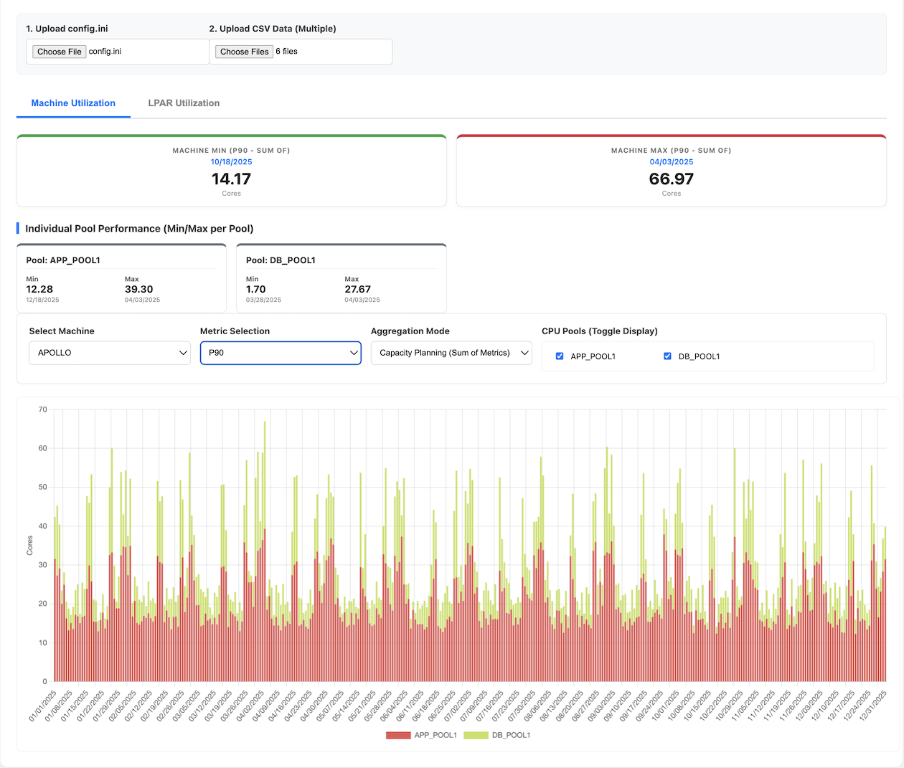
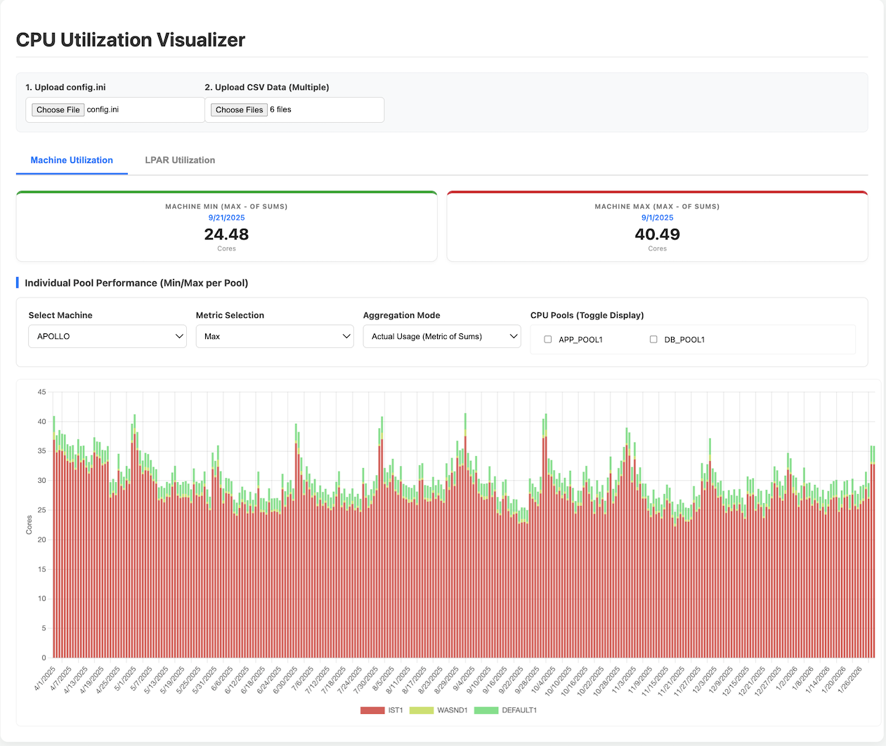

# IBM System P CPU Utilization Visualizer
- [IBM System P CPU Utilization Visualizer](#ibm-system-p-cpu-utilization-visualizer)
  - [Project Structure](#project-structure)
  - [Features](#features)
    - [Machine Utilization View](#machine-utilization-view)
    - [LPAR Utilization View](#lpar-utilization-view)
  - [Screenshots](#screenshots)
    - [Machine CPU Utilization (Sum by Pool)](#machine-cpu-utilization-sum-by-pool)
    - [LPAR CPU Utilization (by Date)](#lpar-cpu-utilization-by-date)
  - [How to Use](#how-to-use)
  - [Data Formats](#data-formats)
    - [`config.ini`](#configini)
    - [CSV Performance Data](#csv-performance-data)
  - [Example Data Generation (Python)](#example-data-generation-python)
  - [Technologies Used](#technologies-used)
  - [Development](#development)

A single-page web application for visualizing historical CPU utilization data from IBM System P machines. This tool helps analyze CPU usage patterns across multiple LPARs (Logical Partitions) organized by CPU Pools.

## Project Structure
 
```
cpu-utilization-visualizer/
├── visualizer.html         # Main application file
├── config.ini              # Machine and CPU Pool configuration
├── data/                   # CSV files containing CPU utilization data
│   ├── lpar1.csv
│   ├── lpar2.csv
│   └── ...
└── README.md               # This file
```

## Features

-   **Browser-based SPA:** Runs entirely in your web browser, no server-side setup required.
-   **Data Ingestion:** Upload `config.ini` for machine and LPAR pool definitions, and multiple CSV files for LPAR performance data.
-   **Configurable Standby LPARs:** LPARs defined in `config.ini` but without corresponding CSV data are treated as standby, using a configurable default CPU core value (defaulting to 0.1).
-   **Percentile Calculation:** Supports both Inclusive (INC) and Exclusive (EXC) methods for percentile calculations, configurable via `config.ini`.

### Machine Utilization View

-   **Stacked Bar Chart:** Visualizes daily CPU utilization for a selected machine, stacked by CPU pool.
-   **Metric Selection:** Choose between Max, Average, or various Percentiles (P50, P60, P70, P80, P90, P95) for daily aggregation.
-   **Pool Toggling:** Dynamically show/hide individual CPU pools on the chart.
-   **Summary Dashboard:** Displays the minimum and maximum total daily CPU cores across the entire period for the selected machine and metric, along with per-pool min/max statistics.

### LPAR Utilization View

-   **Stacked Line Chart:** Shows intra-day CPU utilization (5-minute intervals) for selected LPARs on a specific date.
-   **Combined View:** Aggregates and displays the utilization of multiple selected LPARs.
-   **Summary Dashboard:** Provides detailed statistics for the selected LPARs' combined utilization, including Min, Max, Average, P50, P60, P70, P80, P90, and P95.

## Screenshots

### Machine CPU Utilization (Sum by Pool)



### LPAR CPU Utilization (by Date)



## How to Use

1.  **Open `visualizer.html`:** Simply open the `visualizer.html` file in your web browser (e.g., Chrome, Firefox, Edge).
2.  **Upload `config.ini`:** Click "Upload config.ini" and select your configuration file. This defines your machines, CPU pools, and LPARs.
3.  **Upload CSV Data:** Click "Upload CSV Data (Multiple)" and select all your LPAR performance CSV files.
    *   **CSV File Naming:** Each CSV file should be named after the LPAR (e.g., `lpar1.csv`).
    *   **CSV Content:** Each row represents a day, starting with the date (mm/dd/yyyy) followed by 288 columns of 5-minute interval CPU utilization data.
4.  **Navigate Tabs:** Switch between "Machine Utilization" and "LPAR Utilization" tabs.
5.  **Select Options:** Use the dropdowns and checkboxes to select machines, dates, metrics, and specific LPARs or CPU pools to visualize the data.

## Data Formats

### `config.ini`

-   Sections `[Machine Name]` define machines.
-   Under each machine, `CPU POOL NAME=LPAR1,LPAR2,...` defines pools and their member LPARs.
-   The `[MAIN]` section can define `PERCENTILE` (INC/EXC) and `STANDBY` (numeric value for LPARs without CSV data).
-   Lines starting with # are comments and will be ignored
    *   **Example `config.ini` structure:**
        ```ini
        [MAIN]
        PERCENTILE=INC  ; or EXC
        STANDBY=0.1     ; default value for standby LPARs if no CSV data
        [MACHINE1]
        POOL1=LPAR1,LPAR3,LPAR5
        POOL2=LPAR7,LPAR9
        [MACHINE2]
        POOL1=LPAR2,LPAR4,LPAR6
        POOL2=LPAR8,LPAR10
        ```

### CSV Performance Data

-   **Filename:** `lparname.csv` (e.g., `lpar1.csv`).
-   **Content:**
    -   First column: Date in `mm/dd/yyyy` format (e.g., 04/30/2026)
    -   Next 288 columns: CPU utilization in cores for 5-minute intervals (representing 24 hours).
    *   **Example `config.ini` structure:**
    ```csv
    Date,00:00,00:05,00:10,...,23:50,23:55
    04/01/2026,2.5,2.8,3.1,...,2.2,2.0
    04/02/2026,3.2,3.5,3.8,...,3.0,2.8
    ```
    <!-- -   (Note: The last 3 columns mentioned in `requirements.md` for max, p90, p95 are currently ignored by the visualizer, as it calculates these dynamically from the 288 intervals.) -->
## Example Data Generation (Python)

 [Data Generator](DATA_GENERATOR_GUIDE.md)

## Technologies Used

-   **HTML5:** Structure of the web page.
-   **CSS3:** Styling.
-   **JavaScript (ES6+):** Core logic for data parsing, calculations, and UI interaction.
-   **Chart.js:** For rendering interactive charts. Loaded via CDN

## Development

The project is designed to be self-contained within `visualizer.html`, making it easy to deploy and use locally.